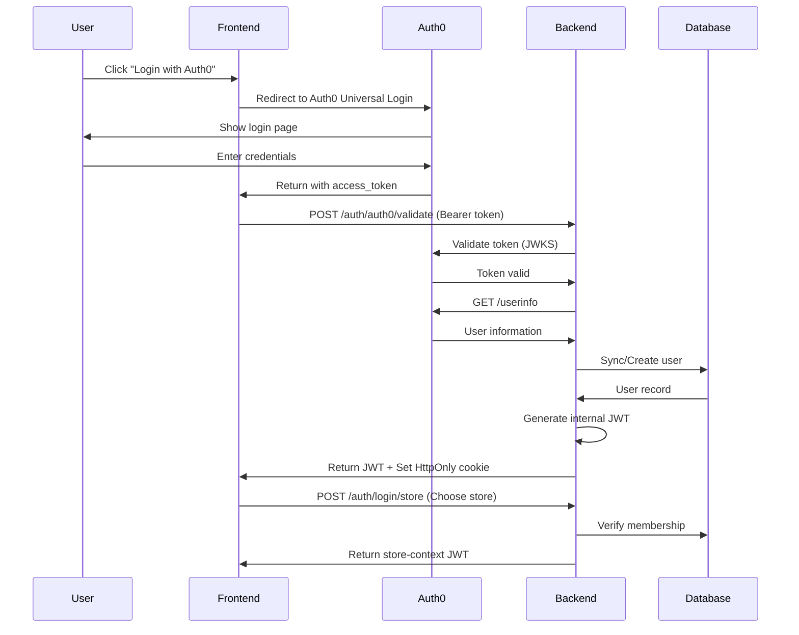
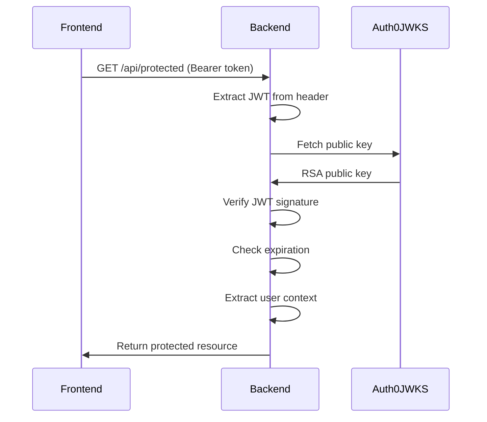

# Auth0 Integration Documentation

## Table of Contents

1. [Overview](#overview)
2. [Architecture](#architecture)
3. [Setup Guide](#setup-guide)
4. [Authentication Flows](#authentication-flows)
5. [API Endpoints](#api-endpoints)
6. [Migration Guide](#migration-guide)
7. [Frontend Integration](#frontend-integration)
8. [Testing Auth0](#testing-auth0)
9. [Troubleshooting](#troubleshooting)
10. [Security Considerations](#security-considerations)

---

## Overview

Origin Food House is implementing Auth0 as the primary authentication provider while maintaining backward compatibility with existing JWT-based authentication. This hybrid approach allows for a smooth transition and supports both authentication methods during the migration period.

### Key Features

- **Auth0 Universal Login**: Secure, customizable authentication
- **Social Login Support**: Google, Facebook, etc. (when configured)
- **Multi-Factor Authentication**: Enhanced security options
- **Email Verification**: Automatic sync with Auth0 verification status
- **Backward Compatibility**: Existing JWT flow remains functional
- **Automatic User Sync**: Auth0 users automatically synced to local database

### Current Status

✅ **Completed**:
- Auth0 configuration module
- Token validation service
- User synchronization logic
- Auth0 Guard for protected routes
- Database migration for Auth0 fields

⚠️ **In Progress**:
- Frontend Auth0 SDK integration
- Password reset flow via Auth0
- User registration via Auth0

❌ **Not Started**:
- Complete deprecation of local auth
- Auth0 Management API integration
- WebSocket authentication with Auth0

---

## Architecture

### System Components

```
┌─────────────────────────────────────────────────────────────┐
│                     Frontend Application                      │
│                  (React/Angular/Vue + Auth0 SDK)              │
└────────────────────┬───────────────┬────────────────────────┘
                     │               │
                     │ Auth0 Login   │ API Calls
                     │               │
┌────────────────────▼───────────────▼────────────────────────┐
│                        Auth0 Service                          │
│              (Authentication & User Management)               │
└────────────────────┬────────────────────────────────────────┘
                     │ Access Token
                     │
┌────────────────────▼────────────────────────────────────────┐
│                    Backend API (NestJS)                       │
│  ┌──────────────────────────────────────────────────────┐   │
│  │                  Auth0 Integration Layer              │   │
│  │  - Token Validation (JWKS)                          │   │
│  │  - User Sync Service                                │   │
│  │  - Auth0 Strategy (Passport)                        │   │
│  └──────────────────────────────────────────────────────┘   │
│  ┌──────────────────────────────────────────────────────┐   │
│  │              Internal JWT System (Legacy)            │   │
│  │  - JWT Generation for store context                  │   │
│  │  - Session management                                │   │
│  └──────────────────────────────────────────────────────┘   │
└─────────────────────────────────────────────────────────────┘
```

### Directory Structure

```
src/auth/
├── config/
│   └── auth0.config.ts         # Auth0 configuration with validation
├── services/
│   └── auth0.service.ts        # Auth0 API interactions
├── strategies/
│   └── auth0.strategy.ts       # Passport Auth0 JWT strategy
├── guards/
│   ├── auth0.guard.ts          # Auth0 authentication guard
│   └── jwt-auth.guard.ts       # Internal JWT guard (existing)
├── types/
│   └── auth0.types.ts          # TypeScript interfaces for Auth0
├── auth.controller.ts          # Authentication endpoints
├── auth.service.ts             # Core authentication logic
└── auth.module.ts              # Module configuration
```

---

## Setup Guide

### Step 1: Create Auth0 Tenant

1. Sign up for Auth0 at https://auth0.com
2. Create a new tenant (e.g., `origin-food-house`)
3. Note your tenant domain: `your-tenant.auth0.com`

### Step 2: Configure Auth0 Application

1. Navigate to **Applications** in Auth0 Dashboard
2. Create a new **Single Page Application**
3. Configure the following settings:

```
Application Name: Origin Food House
Application Type: Single Page Application

Allowed Callback URLs:
- http://localhost:3001/callback
- http://localhost:3002/callback
- https://your-production-domain.com/callback

Allowed Logout URLs:
- http://localhost:3001
- http://localhost:3002
- https://your-production-domain.com

Allowed Web Origins:
- http://localhost:3001
- http://localhost:3002
- https://your-production-domain.com

Allowed Origins (CORS):
- http://localhost:3000
- https://api.your-production-domain.com
```

### Step 3: Create API in Auth0

1. Navigate to **APIs** in Auth0 Dashboard
2. Create a new API:

```
Name: Origin Food House API
Identifier: https://api.origin-food-house.com
Signing Algorithm: RS256
```

3. Enable **RBAC** and **Add Permissions in the Access Token**

### Step 4: Configure Environment Variables

Update your `.env` file with Auth0 credentials:

```env
# Auth0 Configuration (Required for Auth0 authentication)
AUTH0_DOMAIN="your-tenant.auth0.com"
AUTH0_CLIENT_ID="your-client-id"
AUTH0_CLIENT_SECRET="your-client-secret"
AUTH0_AUDIENCE="https://api.origin-food-house.com"
AUTH0_ISSUER="https://your-tenant.auth0.com/"
AUTH0_CALLBACK_URL="http://localhost:3001/callback"

# Optional: Management API Token (for user management operations)
AUTH0_MANAGEMENT_API_TOKEN=""

# Existing JWT Configuration (Still required for internal tokens)
JWT_SECRET="your-internal-jwt-secret"
JWT_EXPIRES_IN="1d"
```

### Step 5: Database Migration

Run the Auth0 database migration:

```bash
# This migration adds auth0Id and isEmailVerified fields
npm run migrate:db
npm run generate:db
```

---

## Authentication Flows

### Flow 1: Auth0 Authentication (Recommended)



### Flow 2: Protected Route Access



### Flow 3: Hybrid Authentication (During Migration)

The system supports both Auth0 and internal JWT authentication:

1. **Auth0 Users**: Authenticate via Auth0 → Get internal JWT → Access all endpoints
2. **Legacy Users**: Use existing JWT flow → Gradually migrate to Auth0
3. **Customer Sessions**: Continue using session JWTs (no Auth0 required)

---

## API Endpoints

### Auth0 Configuration

#### GET /auth/auth0/config
Returns Auth0 configuration for frontend initialization.

**Response:**
```json
{
  "status": "success",
  "data": {
    "domain": "your-tenant.auth0.com",
    "clientId": "your-client-id",
    "audience": "https://api.origin-food-house.com",
    "enabled": true
  }
}
```

### Auth0 Token Validation

#### POST /auth/auth0/validate
Validates Auth0 access token and syncs user to local database.

**Headers:**
```
Authorization: Bearer <auth0-access-token>
```

**Response:**
```json
{
  "status": "success",
  "data": {
    "access_token": "internal-jwt-token",
    "user": {
      "id": "user-uuid",
      "email": "user@example.com",
      "name": "User Name"
    }
  }
}
```

**Process:**
1. Validates Auth0 token using JWKS
2. Fetches user info from Auth0
3. Syncs user to local database
4. Generates internal JWT
5. Sets HttpOnly cookie

### Auth0 Protected Profile

#### GET /auth/auth0/profile
Example of Auth0-protected endpoint using Auth0Guard.

**Headers:**
```
Authorization: Bearer <auth0-access-token>
```

**Response:**
```json
{
  "status": "success",
  "data": {
    "id": "user-uuid",
    "email": "user@example.com",
    "name": "User Name",
    "auth0Id": "auth0|user-id",
    "auth0Metadata": {}
  }
}
```

### Store Selection (Post-Auth0)

#### POST /auth/login/store
Select a store after Auth0 authentication.

**Headers:**
```
Authorization: Bearer <internal-jwt-from-auth0-validate>
```

**Body:**
```json
{
  "storeId": "store-uuid"
}
```

**Response:**
```json
{
  "status": "success",
  "data": {
    "access_token": "jwt-with-store-context"
  }
}
```

---

## Migration Guide

### For Existing Users

#### Phase 1: Dual Authentication (Current)
- Existing users can continue using email/password
- New users encouraged to use Auth0
- Auth0 users automatically synced to database

#### Phase 2: Soft Migration (Planned)
1. Add "Login with Auth0" button alongside existing login
2. Prompt existing users to link Auth0 account
3. Match by email and update `auth0Id` field
4. Gradually deprecate password-based login

#### Phase 3: Full Migration (Future)
1. Disable local password authentication
2. Force all users to Auth0
3. Remove password-related endpoints
4. Clean up legacy authentication code

### Database Migration Script

```typescript
// Example migration for existing users
async function linkExistingUsersToAuth0() {
  const users = await prisma.user.findMany({
    where: { auth0Id: null }
  });

  for (const user of users) {
    // Check if user exists in Auth0 by email
    const auth0User = await auth0.getUserByEmail(user.email);

    if (auth0User) {
      await prisma.user.update({
        where: { id: user.id },
        data: {
          auth0Id: auth0User.user_id,
          isEmailVerified: auth0User.email_verified
        }
      });
    } else {
      // Create user in Auth0
      const newAuth0User = await auth0.createUser({
        email: user.email,
        name: user.name,
        connection: 'Username-Password-Authentication',
        password: generateTemporaryPassword(),
        email_verified: user.verified
      });

      await prisma.user.update({
        where: { id: user.id },
        data: { auth0Id: newAuth0User.user_id }
      });

      // Send password reset email
      await auth0.sendPasswordResetEmail(user.email);
    }
  }
}
```

---

## Frontend Integration

### React Example

#### 1. Install Auth0 React SDK
```bash
npm install @auth0/auth0-react
```

#### 2. Configure Auth0Provider
```typescript
// App.tsx
import { Auth0Provider } from '@auth0/auth0-react';

function App() {
  return (
    <Auth0Provider
      domain="your-tenant.auth0.com"
      clientId="your-client-id"
      authorizationParams={{
        redirect_uri: window.location.origin + '/callback',
        audience: 'https://api.origin-food-house.com',
        scope: 'openid profile email'
      }}
    >
      <Router>
        {/* Your app components */}
      </Router>
    </Auth0Provider>
  );
}
```

#### 3. Login Component
```typescript
// LoginButton.tsx
import { useAuth0 } from '@auth0/auth0-react';

export function LoginButton() {
  const { loginWithRedirect, isAuthenticated, getAccessTokenSilently } = useAuth0();

  const handleLogin = async () => {
    if (!isAuthenticated) {
      await loginWithRedirect();
    } else {
      // Get Auth0 access token
      const auth0Token = await getAccessTokenSilently();

      // Exchange for backend JWT
      const response = await fetch('/auth/auth0/validate', {
        method: 'POST',
        headers: {
          'Authorization': `Bearer ${auth0Token}`
        }
      });

      const { data } = await response.json();
      // Store internal JWT for subsequent API calls
      localStorage.setItem('jwt', data.access_token);

      // Redirect to store selection
      navigate('/select-store');
    }
  };

  return (
    <button onClick={handleLogin}>
      {isAuthenticated ? 'Continue to App' : 'Login with Auth0'}
    </button>
  );
}
```

#### 4. API Request Interceptor
```typescript
// api.ts
import axios from 'axios';
import { getAccessTokenSilently } from '@auth0/auth0-react';

const api = axios.create({
  baseURL: process.env.REACT_APP_API_URL
});

api.interceptors.request.use(async (config) => {
  // Use internal JWT for most requests
  const jwt = localStorage.getItem('jwt');
  if (jwt) {
    config.headers.Authorization = `Bearer ${jwt}`;
  }

  // For Auth0-specific endpoints, use Auth0 token
  if (config.url?.includes('/auth/auth0/')) {
    const auth0Token = await getAccessTokenSilently();
    config.headers.Authorization = `Bearer ${auth0Token}`;
  }

  return config;
});
```

### Angular Example

#### 1. Install Auth0 Angular SDK
```bash
npm install @auth0/auth0-angular
```

#### 2. Configure Auth0Module
```typescript
// app.module.ts
import { AuthModule } from '@auth0/auth0-angular';

@NgModule({
  imports: [
    AuthModule.forRoot({
      domain: 'your-tenant.auth0.com',
      clientId: 'your-client-id',
      authorizationParams: {
        redirect_uri: window.location.origin,
        audience: 'https://api.origin-food-house.com'
      }
    })
  ]
})
export class AppModule { }
```

---

## Testing Auth0

### Local Development Testing

#### 1. Mock Auth0 Service
```typescript
// test/mocks/auth0.service.mock.ts
export class MockAuth0Service {
  async validateToken(token: string) {
    return {
      sub: 'auth0|test-user-id',
      email: 'test@example.com',
      email_verified: true
    };
  }

  async getUserInfo(token: string) {
    return {
      sub: 'auth0|test-user-id',
      email: 'test@example.com',
      email_verified: true,
      name: 'Test User'
    };
  }
}
```

#### 2. E2E Test Example
```typescript
describe('Auth0 Authentication (e2e)', () => {
  it('should validate Auth0 token and sync user', async () => {
    const auth0Token = 'mock-auth0-token';

    const response = await request(app.getHttpServer())
      .post('/auth/auth0/validate')
      .set('Authorization', `Bearer ${auth0Token}`)
      .expect(200);

    expect(response.body).toHaveProperty('data.access_token');
    expect(response.body).toHaveProperty('data.user.email');
  });
});
```

### Auth0 Test Tenant

1. Create a separate Auth0 tenant for testing
2. Use Auth0's test users feature
3. Configure test application with localhost URLs

### Postman Collection

```json
{
  "name": "Auth0 Endpoints",
  "requests": [
    {
      "name": "Get Auth0 Config",
      "request": {
        "method": "GET",
        "url": "{{baseUrl}}/auth/auth0/config"
      }
    },
    {
      "name": "Validate Auth0 Token",
      "request": {
        "method": "POST",
        "url": "{{baseUrl}}/auth/auth0/validate",
        "header": [
          {
            "key": "Authorization",
            "value": "Bearer {{auth0_token}}"
          }
        ]
      }
    },
    {
      "name": "Get Auth0 Profile",
      "request": {
        "method": "GET",
        "url": "{{baseUrl}}/auth/auth0/profile",
        "header": [
          {
            "key": "Authorization",
            "value": "Bearer {{auth0_token}}"
          }
        ]
      }
    }
  ]
}
```

---

## Troubleshooting

### Common Issues

#### 1. "Invalid Auth0 token" Error
**Symptoms:**
- 401 Unauthorized on `/auth/auth0/validate`
- Token validation fails

**Solutions:**
- Verify Auth0 domain and audience match
- Check token hasn't expired
- Ensure JWKS endpoint is accessible
- Verify Auth0 application settings

#### 2. User Sync Failures
**Symptoms:**
- User not created in database
- Email mismatch errors

**Solutions:**
- Check database connection
- Verify email uniqueness constraint
- Check Auth0 user has email claim
- Review sync logic in `auth.service.ts`

#### 3. CORS Issues
**Symptoms:**
- Frontend can't call Auth0 endpoints
- Preflight request fails

**Solutions:**
- Add frontend URL to Auth0 Allowed Origins
- Configure CORS in NestJS main.ts
- Check Auth0 application type is SPA

#### 4. JWT Signature Verification Failed
**Symptoms:**
- Auth0 JWT not accepted by backend
- "invalid signature" error

**Solutions:**
- Verify JWKS endpoint URL is correct
- Check Auth0 domain configuration
- Ensure using RS256 algorithm
- Clear JWKS cache if keys rotated

### Debug Mode

Enable detailed Auth0 logging:

```typescript
// auth0.service.ts
export class Auth0Service {
  private readonly logger = new Logger(Auth0Service.name);
  private readonly debug = process.env.AUTH0_DEBUG === 'true';

  async validateToken(token: string) {
    if (this.debug) {
      this.logger.debug(`Validating token: ${token.substring(0, 20)}...`);
    }
    // ... validation logic
  }
}
```

Set in `.env`:
```env
AUTH0_DEBUG=true
```

---

## Security Considerations

### Best Practices

1. **Token Storage**
   - Never store Auth0 tokens in localStorage
   - Use HttpOnly cookies for session tokens
   - Implement token refresh strategy

2. **JWKS Caching**
   - Cache JWKS keys to reduce latency
   - Implement cache invalidation on key rotation
   - Set reasonable TTL (e.g., 10 minutes)

3. **User Sync Security**
   - Always verify email ownership
   - Don't auto-merge accounts without verification
   - Log all sync operations for audit

4. **Rate Limiting**
   - Implement rate limiting on validation endpoint
   - Prevent token validation abuse
   - Monitor for suspicious patterns

5. **Scope Management**
   - Request minimal scopes needed
   - Validate scopes in protected endpoints
   - Use RBAC for fine-grained control

### Security Headers

```typescript
// main.ts
app.use(helmet({
  contentSecurityPolicy: {
    directives: {
      defaultSrc: ["'self'"],
      connectSrc: ["'self'", "https://*.auth0.com"],
      frameSrc: ["https://*.auth0.com"],
      scriptSrc: ["'self'", "https://*.auth0.com"]
    }
  }
}));
```

### Monitoring & Alerts

1. Set up Auth0 monitoring:
   - Failed login attempts
   - Suspicious login patterns
   - Token validation failures

2. Backend monitoring:
   - User sync failures
   - JWT generation errors
   - Unusual API patterns

3. Alerts:
   - Multiple failed validations from same IP
   - Rapid user creation
   - Token replay attempts

---

## Appendix

### Environment Variables Reference

```env
# Required for Auth0
AUTH0_DOMAIN="your-tenant.auth0.com"
AUTH0_CLIENT_ID="your-client-id"
AUTH0_CLIENT_SECRET="your-client-secret"
AUTH0_AUDIENCE="https://api.origin-food-house.com"
AUTH0_ISSUER="https://your-tenant.auth0.com/"

# Optional Auth0 settings
AUTH0_CALLBACK_URL="http://localhost:3001/callback"
AUTH0_MANAGEMENT_API_TOKEN=""
AUTH0_DEBUG="false"

# Still required for internal JWT
JWT_SECRET="your-secret"
JWT_EXPIRES_IN="1d"
JWT_REFRESH_SECRET="your-refresh-secret"
JWT_REFRESH_EXPIRES_IN="7d"
```

### Useful Auth0 Resources

- [Auth0 Documentation](https://auth0.com/docs)
- [Auth0 React Quickstart](https://auth0.com/docs/quickstart/spa/react)
- [Auth0 Angular Quickstart](https://auth0.com/docs/quickstart/spa/angular)
- [JWKS Endpoint](https://auth0.com/docs/tokens/json-web-tokens/json-web-key-sets)
- [Auth0 Management API](https://auth0.com/docs/api/management/v2)

### Migration Checklist

- [ ] Create Auth0 tenant
- [ ] Configure Auth0 application
- [ ] Set up Auth0 API
- [ ] Update environment variables
- [ ] Run database migration
- [ ] Test Auth0 validation endpoint
- [ ] Implement frontend Auth0 SDK
- [ ] Test end-to-end flow
- [ ] Update user documentation
- [ ] Plan user migration strategy
- [ ] Set up monitoring
- [ ] Deploy to staging
- [ ] Test with real users
- [ ] Deploy to production
- [ ] Monitor and iterate

---

**Document Version:** 1.0
**Last Updated:** 2025-10-13
**Status:** In Progress
**Next Review:** After Phase 2 Migration