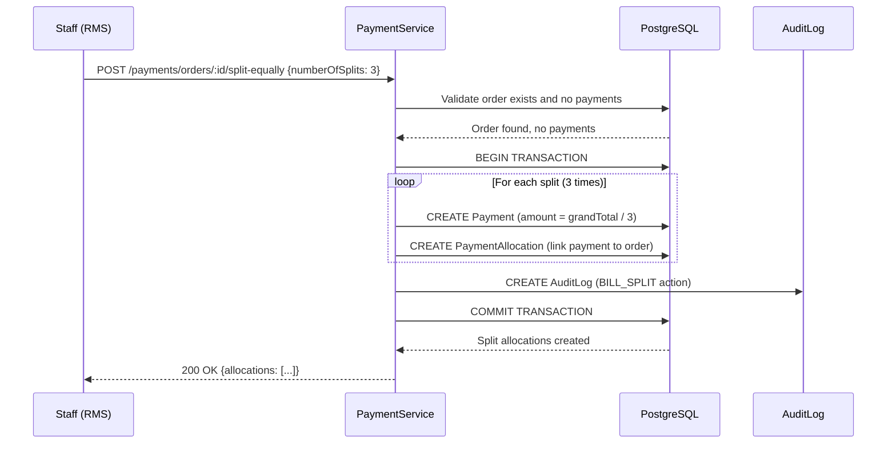
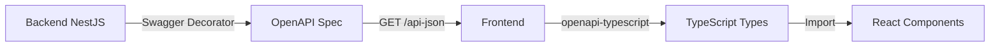
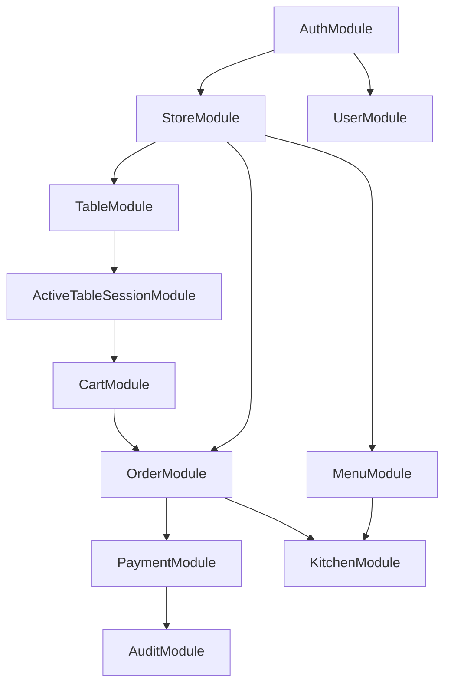

# Release Slice A - Architecture Design Document

**Date**: January 23, 2025
**Agent**: Solution Architect
**Type**: Architecture Design
**Status**: Proposed
**Scope**: Missing features for Release Slice A completion

---

## Executive Summary

This document provides comprehensive architectural design for implementing the missing features in Release Slice A. The gap analysis identified **75% completion** with critical gaps primarily in frontend implementation and several backend enhancements needed.

**Key Architectural Decisions**:
- Extend existing modular monolith architecture (no new microservices)
- Add 5 new Prisma models for missing functionality
- Enhance 4 existing modules with new capabilities
- Preserve multi-tenant isolation and soft delete patterns
- Maintain 85%+ test coverage requirement

**Critical Blocker Resolution**: QR Code Generation UI requires server-side rendering with client-side download capability.

---

## Table of Contents

1. [Architecture Assessment](#1-architecture-assessment)
2. [Data Model Changes](#2-data-model-changes)
3. [Module Enhancements](#3-module-enhancements)
4. [Critical Feature Designs](#4-critical-feature-designs)
5. [Integration Architecture](#5-integration-architecture)
6. [Security Architecture](#6-security-architecture)
7. [Performance Optimization](#7-performance-optimization)
8. [Migration Strategy](#8-migration-strategy)
9. [Implementation Roadmap](#9-implementation-roadmap)

---

## 1. Architecture Assessment

### 1.1 Current Architecture Strengths

**✅ Solid Foundations**:
- Modular monolith with clear domain boundaries (11 modules)
- Multi-tenant data isolation via `storeId` enforcement
- Comprehensive test coverage (257 tests, 70%+ coverage)
- Soft delete pattern implemented on critical entities
- RBAC with 5 roles (OWNER, ADMIN, CHEF, CASHIER, SERVER)
- Real-time capabilities via Socket.IO (Cart sync)

**✅ Well-Designed Modules**:
- CartService: 91% coverage, 52 tests ✅
- OrderService: 98% coverage, 78 tests ✅
- MenuService: 85% coverage ✅
- CategoryService: 85% coverage ✅

### 1.2 Architectural Gaps

**❌ Missing Domain Concepts**:
1. **Routing Areas**: No kitchen station concept (Grill, Fry, Salad, Drinks)
2. **Table State Management**: Table status inferred from session (not explicit)
3. **Discounts**: No discount model or application logic
4. **Bill Splitting**: Single payment per order assumption
5. **Audit Logging**: Refund/void actions not logged systematically

**⚠️ State Management Concerns**:
- Table state, Session status, and Order status are loosely coupled
- Risk of state inconsistencies (e.g., ACTIVE session on VACANT table)
- No state transition validation

**⚠️ Real-time Architecture Gaps**:
- Cart uses WebSocket, but KDS does not
- No real-time notification for new orders to kitchen
- Manual polling required for KDS updates

### 1.3 Architecture Verdict

**Current architecture CAN support all missing features** without major refactoring.

**Recommended Approach**: **Incremental Enhancement**
- Extend existing modules with new capabilities
- Add new models to Prisma schema
- Implement state machine pattern for complex state transitions
- Add audit logging as cross-cutting concern

**No Breaking Changes Required** - All enhancements are additive.

---

## 2. Data Model Changes

### 2.1 Overview of Schema Changes

**New Models**: 5
**Enhanced Models**: 4
**New Enums**: 2
**Migration Complexity**: Medium

```mermaid
erDiagram
    MenuItem ||--o{ RoutingArea : "has"
    Table ||--|| TableStatus : "has"
    Order ||--o{ Discount : "has"
    Order ||--o{ PaymentAllocation : "split via"
    Payment ||--o{ PaymentAllocation : "allocated to"
    AuditLog ||--o{ User : "performed by"

    MenuItem {
        string id PK
        string routingArea ENUM
        int preparationTimeMinutes
    }

    Table {
        string id PK
        string floorArea
        TableStatus currentStatus ENUM
    }

    Discount {
        string id PK
        string orderId FK
        DiscountType type ENUM
        decimal amount
        string appliedBy FK
        string reason
    }

    PaymentAllocation {
        string id PK
        string paymentId FK
        string orderId FK
        decimal amount
        string allocatedBy FK
    }

    Payment {
        string id PK
        decimal amountTendered
        decimal change
    }

    AuditLog {
        string id PK
        string entityType
        string entityId
        AuditAction action ENUM
        string performedBy FK
        json metadata
    }
```

### 2.2 Detailed Schema Changes

#### 2.2.1 MenuItem Enhancement (Routing Areas + Preparation Times)

**Purpose**: Support KDS routing and time estimation

```prisma
model MenuItem {
  id                     String    @id @default(uuid(7))
  name                   String
  description            String?
  basePrice              Decimal   @db.Decimal(10, 2)
  imageUrl               String?
  categoryId             String
  storeId                String
  sortOrder              Int       @default(0)
  isOutOfStock           Boolean   @default(false)
  isHidden               Boolean   @default(false)

  // NEW FIELDS
  routingArea            RoutingArea? @default(OTHER)
  preparationTimeMinutes Int?      @default(15) // Default 15 minutes

  createdAt              DateTime  @default(now())
  updatedAt              DateTime  @default(now()) @updatedAt
  deletedAt              DateTime?

  category               Category             @relation(fields: [categoryId], references: [id])
  store                  Store                @relation(fields: [storeId], references: [id], onDelete: Cascade)
  customizationGroups    CustomizationGroup[]
  orderItems             OrderItem[]
  cartItems              CartItem[]

  @@index([storeId, categoryId, sortOrder])
  @@index([deletedAt])
  @@index([deletedAt, isHidden])
  @@index([storeId, routingArea]) // NEW INDEX for KDS filtering
}

enum RoutingArea {
  GRILL
  FRY
  SALAD
  DRINKS
  DESSERT
  APPETIZER
  SOUP
  OTHER
}
```

**Migration Impact**:
- **Non-breaking**: New fields are optional/default
- **Data**: Existing items default to `OTHER` routing area, 15 min prep time
- **Indexes**: Add composite index `(storeId, routingArea)` for efficient KDS queries

**Business Logic Changes**:
1. MenuService must validate `routingArea` enum on create/update
2. KDS endpoint must filter by `routingArea` query parameter
3. Order creation must snapshot `preparationTimeMinutes` for SLA tracking

---

#### 2.2.2 Table Enhancement (Floor Areas + Table State)

**Purpose**: Explicit table state management and floor organization

```prisma
model Table {
  id           String      @id @default(uuid(7))
  storeId      String
  name         String

  // NEW FIELDS
  floorArea    String?     // e.g., "Main Dining", "Patio", "Bar"
  currentStatus TableStatus @default(VACANT)
  lastStatusChange DateTime @default(now())

  createdAt    DateTime    @default(now())
  updatedAt    DateTime    @default(now()) @updatedAt

  store        Store       @relation(fields: [storeId], references: [id], onDelete: Cascade)
  activeTableSessions ActiveTableSession[]

  @@unique([storeId, name])
  @@index([storeId, name])
  @@index([storeId, currentStatus]) // NEW INDEX for status filtering
  @@index([storeId, floorArea])     // NEW INDEX for floor filtering
}

enum TableStatus {
  VACANT        // No active session
  SEATED        // Session created, no orders yet
  ORDERING      // Items added to cart
  SERVED        // Order delivered to table
  READY_TO_PAY  // Bill requested
  CLEANING      // Session closed, table being cleaned
}
```

**State Transition Rules** (enforced in TableService):

```
VACANT → SEATED (when session created)
SEATED → ORDERING (when first item added to cart)
ORDERING → SERVED (when order status = SERVED)
SERVED → READY_TO_PAY (when customer requests bill)
READY_TO_PAY → CLEANING (when payment completed)
CLEANING → VACANT (when staff marks table clean)
```

**Migration Impact**:
- **Breaking**: Requires data migration for `currentStatus` (infer from active sessions)
- **Complexity**: Migration must analyze session/order status to set initial state
- **Rollback**: Store previous state in migration metadata

**Migration Script Logic**:
```typescript
// For each table
if (hasActiveSession) {
  const session = getActiveSession(table.id);
  const orders = getOrdersForSession(session.id);

  if (orders.some(o => o.status === 'SERVED')) {
    table.currentStatus = 'SERVED';
  } else if (orders.length > 0) {
    table.currentStatus = 'ORDERING';
  } else if (hasCartItems(session.id)) {
    table.currentStatus = 'ORDERING';
  } else {
    table.currentStatus = 'SEATED';
  }
} else {
  table.currentStatus = 'VACANT';
}
```

---

#### 2.2.3 Discount Model (NEW)

**Purpose**: Track discounts applied to orders with audit trail

```prisma
model Discount {
  id          String       @id @default(uuid(7))
  orderId     String
  storeId     String       // For multi-tenant isolation
  type        DiscountType
  amount      Decimal      @db.Decimal(10, 2) // For FIXED type
  percentage  Decimal?     @db.Decimal(5, 2)  // For PERCENTAGE type (e.g., 15.00 = 15%)
  reason      String?      // e.g., "Birthday discount", "Manager comp"
  appliedBy   String       // User ID who applied discount
  appliedAt   DateTime     @default(now())

  order       Order        @relation(fields: [orderId], references: [id], onDelete: Cascade)

  createdAt   DateTime     @default(now())
  updatedAt   DateTime     @default(now()) @updatedAt

  @@index([orderId])
  @@index([storeId, appliedAt]) // For discount reports
}

enum DiscountType {
  FIXED       // Flat amount discount (e.g., $5 off)
  PERCENTAGE  // Percentage discount (e.g., 10% off)
}
```

**Business Rules**:
1. Discount cannot exceed `order.grandTotal`
2. Only OWNER/ADMIN/CASHIER can apply discounts (RBAC)
3. Multiple discounts allowed per order (cumulative)
4. Discount recalculates `grandTotal` but not `subTotal`

**Order Calculation Formula** (with discounts):
```typescript
grandTotal = subTotal + vatAmount + serviceChargeAmount - SUM(discounts)
```

**Migration Impact**: Non-breaking (new table)

---

#### 2.2.4 Payment Enhancement (Cash Handling)

**Purpose**: Support change calculation for cash payments

```prisma
model Payment {
  id              String        @id @default(uuid(7))
  orderId         String
  amount          Decimal       @db.Decimal(10, 2)

  // NEW FIELDS
  amountTendered  Decimal?      @db.Decimal(10, 2) // Amount given by customer (cash only)
  change          Decimal?      @db.Decimal(10, 2) // Change returned (cash only)

  paymentMethod   PaymentMethod
  transactionId   String?       // External payment gateway transaction ID
  notes           String?

  order           Order         @relation(fields: [orderId], references: [id], onDelete: Cascade)
  allocations     PaymentAllocation[] // NEW RELATION for bill splitting

  createdAt       DateTime      @default(now())
  updatedAt       DateTime      @default(now()) @updatedAt

  @@index([orderId])
  @@index([transactionId])
}
```

**Business Logic**:
```typescript
if (paymentMethod === PaymentMethod.CASH) {
  if (!amountTendered) {
    throw new BadRequestException('Amount tendered required for cash payments');
  }

  change = new Decimal(amountTendered).minus(amount);

  if (change.lessThan(0)) {
    throw new BadRequestException('Amount tendered is less than payment amount');
  }
}
```

**Migration Impact**: Non-breaking (optional fields)

---

#### 2.2.5 PaymentAllocation Model (NEW) - Bill Splitting

**Purpose**: Track split payment allocations across multiple payments

```prisma
model PaymentAllocation {
  id          String   @id @default(uuid(7))
  paymentId   String
  orderId     String
  amount      Decimal  @db.Decimal(10, 2) // Portion of payment allocated to this order
  allocatedBy String?  // User ID who created split (nullable for auto-splits)
  notes       String?  // e.g., "Guest 1 portion", "Split 3 ways"

  payment     Payment  @relation(fields: [paymentId], references: [id], onDelete: Cascade)
  order       Order    @relation(fields: [orderId], references: [id], onDelete: Cascade)

  createdAt   DateTime @default(now())
  updatedAt   DateTime @default(now()) @updatedAt

  @@index([paymentId])
  @@index([orderId])
  @@unique([paymentId, orderId]) // One allocation per payment-order pair
}

model Order {
  // ... existing fields

  // NEW RELATIONS
  discounts   Discount[]
  allocations PaymentAllocation[]
}
```

**Bill Splitting Patterns**:

**Pattern 1: Equal Split (N Ways)**
```typescript
// Split $120 bill 3 ways = $40 per person
const amountPerPerson = order.grandTotal.div(guestCount);

for (let i = 0; i < guestCount; i++) {
  createPayment({
    orderId: order.id,
    amount: amountPerPerson,
    paymentMethod: PaymentMethod.CASH // Or card, etc.
  });

  createPaymentAllocation({
    paymentId: payment.id,
    orderId: order.id,
    amount: amountPerPerson,
    notes: `Split ${i + 1} of ${guestCount}`
  });
}
```

**Pattern 2: Split by Item**
```typescript
// Each guest pays for specific items
const guest1Items = orderItems.filter(item => item.guestNumber === 1);
const guest1Total = calculateSubtotal(guest1Items) + allocateCharges(guest1Items);

createPayment({
  orderId: order.id,
  amount: guest1Total,
  paymentMethod: PaymentMethod.CREDIT_CARD
});

createPaymentAllocation({
  paymentId: payment.id,
  orderId: order.id,
  amount: guest1Total,
  notes: 'Guest 1 items: Burger, Fries'
});
```

**Pattern 3: Custom Split (Manual Amounts)**
```typescript
// One person pays $80, another pays $40
createPayment({ amount: new Decimal('80.00') });
createPayment({ amount: new Decimal('40.00') });

// Validation: SUM(allocations.amount) must equal order.grandTotal
```

**Validation Rules**:
1. Sum of all payment allocations must equal `order.grandTotal`
2. Cannot split if any payment already exists (must void payments first)
3. All payments must be of same order
4. Minimum split amount: $0.01

**Migration Impact**: Non-breaking (new table)

---

#### 2.2.6 AuditLog Model (NEW)

**Purpose**: Centralized audit trail for sensitive operations

```prisma
model AuditLog {
  id           String      @id @default(uuid(7))
  entityType   String      // e.g., "Order", "Payment", "Discount"
  entityId     String      // ID of affected entity
  action       AuditAction
  performedBy  String      // User ID
  storeId      String      // Multi-tenant isolation
  metadata     Json?       // Additional context (old/new values, reason, etc.)

  createdAt    DateTime    @default(now())

  @@index([storeId, createdAt])
  @@index([entityType, entityId])
  @@index([performedBy, createdAt])
  @@index([action, createdAt])
}

enum AuditAction {
  ORDER_CREATED
  ORDER_CANCELLED
  ORDER_VOIDED
  PAYMENT_RECORDED
  PAYMENT_REFUNDED
  DISCOUNT_APPLIED
  DISCOUNT_REMOVED
  TABLE_STATE_CHANGED
  ITEM_86ED           // Item marked out of stock
  BILL_SPLIT
}
```

**Usage Pattern**:
```typescript
async recordPayment(userId: string, orderId: string, dto: RecordPaymentDto) {
  const payment = await this.prisma.$transaction(async (tx) => {
    const payment = await tx.payment.create({ data: dto });

    await tx.auditLog.create({
      data: {
        entityType: 'Payment',
        entityId: payment.id,
        action: AuditAction.PAYMENT_RECORDED,
        performedBy: userId,
        storeId: order.storeId,
        metadata: {
          orderId,
          amount: payment.amount.toString(),
          paymentMethod: payment.paymentMethod,
        },
      },
    });

    return payment;
  });

  return payment;
}
```

**Query Patterns**:
```typescript
// Get all refunds by user
const refundAudits = await prisma.auditLog.findMany({
  where: {
    storeId,
    action: AuditAction.PAYMENT_REFUNDED,
    performedBy: userId,
    createdAt: { gte: startDate, lte: endDate }
  },
  orderBy: { createdAt: 'desc' }
});

// Get order history
const orderHistory = await prisma.auditLog.findMany({
  where: {
    entityType: 'Order',
    entityId: orderId
  },
  orderBy: { createdAt: 'asc' }
});
```

**Migration Impact**: Non-breaking (new table)

**Retention Policy**: Archive logs older than 2 years (compliance requirement)

---

### 2.3 Data Model Summary

| Model | Type | Impact | Indexes | Relations |
|-------|------|--------|---------|-----------|
| MenuItem | Enhanced | Non-breaking | +1 | None |
| Table | Enhanced | Breaking | +2 | None |
| Payment | Enhanced | Non-breaking | None | +1 (allocations) |
| Discount | New | Non-breaking | +2 | Order |
| PaymentAllocation | New | Non-breaking | +3 | Payment, Order |
| AuditLog | New | Non-breaking | +4 | None |

**Total Migration Changes**:
- **New Tables**: 3
- **New Columns**: 6
- **New Enums**: 4
- **New Indexes**: 12
- **New Relations**: 4

**Database Size Impact**: ~5-10% increase (estimate based on audit log volume)

---

## 3. Module Enhancements

### 3.1 Module Enhancement Matrix

| Module | Current State | Enhancement Required | Complexity | Priority |
|--------|---------------|---------------------|------------|----------|
| MenuModule | ✅ Stable (85% coverage) | Add routing area logic | Low | HIGH |
| TableModule | ✅ Stable (87% coverage) | Add state management | Medium | HIGH |
| OrderModule | ✅ Stable (98% coverage) | Add discount logic | Medium | MEDIUM |
| PaymentModule | ⚠️ Basic tests only | Add split logic + change calculation | High | HIGH |
| KitchenModule | ❌ No tests | Add routing area filter + real-time | Medium | HIGH |
| AuditModule | ❌ Does not exist | Create new module | Medium | MEDIUM |

### 3.2 MenuModule Enhancement

**New Responsibilities**:
1. Validate `routingArea` enum on menu item create/update
2. Validate `preparationTimeMinutes` (must be > 0)
3. Support KDS queries filtered by routing area

**API Changes**:

```typescript
// New DTO
export class UpdateMenuItemDto {
  @IsOptional()
  @IsEnum(RoutingArea)
  routingArea?: RoutingArea;

  @IsOptional()
  @IsInt()
  @Min(1)
  @Max(300) // Max 5 hours
  preparationTimeMinutes?: number;
}

// Enhanced service method
async updateMenuItem(
  userId: string,
  storeId: string,
  menuItemId: string,
  dto: UpdateMenuItemDto
): Promise<MenuItem> {
  await this.authService.checkStorePermission(
    userId,
    storeId,
    [Role.OWNER, Role.ADMIN]
  );

  return this.prisma.menuItem.update({
    where: { id: menuItemId, storeId, deletedAt: null },
    data: dto,
  });
}
```

**No Breaking Changes** - All enhancements are additive.

---

### 3.3 TableModule Enhancement

**New Responsibilities**:
1. Manage explicit table state transitions
2. Validate state transition rules
3. Support floor area filtering
4. Auto-update state based on session/order events

**State Machine Implementation**:

```typescript
export class TableService {
  private readonly logger = new Logger(TableService.name);

  // State transition map
  private readonly VALID_TRANSITIONS: Record<TableStatus, TableStatus[]> = {
    [TableStatus.VACANT]: [TableStatus.SEATED],
    [TableStatus.SEATED]: [TableStatus.ORDERING, TableStatus.VACANT],
    [TableStatus.ORDERING]: [TableStatus.SERVED, TableStatus.VACANT],
    [TableStatus.SERVED]: [TableStatus.READY_TO_PAY, TableStatus.ORDERING],
    [TableStatus.READY_TO_PAY]: [TableStatus.CLEANING],
    [TableStatus.CLEANING]: [TableStatus.VACANT],
  };

  async updateTableStatus(
    userId: string,
    storeId: string,
    tableId: string,
    newStatus: TableStatus,
    reason?: string
  ): Promise<Table> {
    const method = this.updateTableStatus.name;

    // RBAC check
    await this.authService.checkStorePermission(
      userId,
      storeId,
      [Role.OWNER, Role.ADMIN, Role.SERVER]
    );

    // Get current table
    const table = await this.prisma.table.findUnique({
      where: { id: tableId, storeId },
    });

    if (!table) {
      throw new NotFoundException('Table not found');
    }

    // Validate transition
    const allowedTransitions = this.VALID_TRANSITIONS[table.currentStatus];
    if (!allowedTransitions.includes(newStatus)) {
      throw new BadRequestException(
        `Invalid state transition from ${table.currentStatus} to ${newStatus}`
      );
    }

    this.logger.log(
      `[${method}] Table ${table.name} transitioning: ${table.currentStatus} → ${newStatus}`
    );

    // Update table state
    const updatedTable = await this.prisma.$transaction(async (tx) => {
      const updated = await tx.table.update({
        where: { id: tableId },
        data: {
          currentStatus: newStatus,
          lastStatusChange: new Date(),
        },
      });

      // Audit log
      await tx.auditLog.create({
        data: {
          entityType: 'Table',
          entityId: tableId,
          action: AuditAction.TABLE_STATE_CHANGED,
          performedBy: userId,
          storeId,
          metadata: {
            from: table.currentStatus,
            to: newStatus,
            reason,
          },
        },
      });

      return updated;
    });

    // Emit WebSocket event for real-time dashboard
    this.eventEmitter.emit('table.status.changed', {
      storeId,
      tableId,
      oldStatus: table.currentStatus,
      newStatus,
    });

    return updatedTable;
  }

  /**
   * Auto-transition table state based on session events
   * Called from ActiveTableSessionService
   */
  async autoTransitionOnSessionCreate(tableId: string): Promise<void> {
    const table = await this.prisma.table.findUnique({ where: { id: tableId } });

    if (table?.currentStatus === TableStatus.VACANT) {
      await this.prisma.table.update({
        where: { id: tableId },
        data: {
          currentStatus: TableStatus.SEATED,
          lastStatusChange: new Date(),
        },
      });
    }
  }

  /**
   * Auto-transition when first cart item added
   * Called from CartService
   */
  async autoTransitionOnFirstCartItem(sessionId: string): Promise<void> {
    const session = await this.prisma.activeTableSession.findUnique({
      where: { id: sessionId },
      include: { table: true },
    });

    if (session?.table.currentStatus === TableStatus.SEATED) {
      await this.prisma.table.update({
        where: { id: session.tableId },
        data: {
          currentStatus: TableStatus.ORDERING,
          lastStatusChange: new Date(),
        },
      });
    }
  }
}
```

**API Changes**:

```typescript
// New endpoint
@Patch(':id/status')
@UseGuards(JwtAuthGuard)
async updateTableStatus(
  @GetUser('sub') userId: string,
  @Query('storeId') storeId: string,
  @Param('id') tableId: string,
  @Body() dto: UpdateTableStatusDto
) {
  return this.tableService.updateTableStatus(
    userId,
    storeId,
    tableId,
    dto.status,
    dto.reason
  );
}

// Enhanced GET endpoint
@Get()
@UseGuards(JwtAuthGuard)
async getTables(
  @GetUser('sub') userId: string,
  @Query('storeId') storeId: string,
  @Query('status') status?: TableStatus,
  @Query('floorArea') floorArea?: string
) {
  return this.tableService.findAll(storeId, { status, floorArea });
}
```

**Breaking Change**: Requires data migration for `currentStatus` field.

---

### 3.4 PaymentModule Enhancement

**New Responsibilities**:
1. Calculate change for cash payments
2. Support bill splitting with payment allocations
3. Validate split payment totals
4. Prevent payment on orders with incomplete splits

**Bill Splitting Service**:

```typescript
export class PaymentService {
  /**
   * Split bill equally N ways
   */
  async splitBillEqually(
    userId: string,
    orderId: string,
    numberOfSplits: number
  ): Promise<PaymentAllocation[]> {
    const method = this.splitBillEqually.name;

    // Validate order access
    const order = await this.validateOrderAccess(userId, orderId);

    // Validate no existing payments
    const existingPayments = await this.prisma.payment.count({
      where: { orderId },
    });

    if (existingPayments > 0) {
      throw new BadRequestException(
        'Cannot split bill - payments already exist. Void payments first.'
      );
    }

    // Calculate split amount
    const splitAmount = order.grandTotal.div(numberOfSplits);

    // Handle rounding (last split gets remainder)
    const normalSplitAmount = splitAmount.toDecimalPlaces(2, Decimal.ROUND_DOWN);
    const lastSplitAmount = order.grandTotal.minus(
      normalSplitAmount.mul(numberOfSplits - 1)
    );

    this.logger.log(
      `[${method}] Splitting order ${orderId} ${numberOfSplits} ways: ` +
      `${normalSplitAmount} x ${numberOfSplits - 1} + ${lastSplitAmount}`
    );

    // Create payment allocations (no actual payments yet)
    const allocations = await this.prisma.$transaction(async (tx) => {
      const createdAllocations: PaymentAllocation[] = [];

      for (let i = 0; i < numberOfSplits; i++) {
        const amount = i === numberOfSplits - 1
          ? lastSplitAmount
          : normalSplitAmount;

        // Create placeholder payment
        const payment = await tx.payment.create({
          data: {
            orderId,
            amount,
            paymentMethod: PaymentMethod.CASH, // Default, can be changed later
            notes: `Split ${i + 1} of ${numberOfSplits} (pending)`,
          },
        });

        // Create allocation
        const allocation = await tx.paymentAllocation.create({
          data: {
            paymentId: payment.id,
            orderId,
            amount,
            allocatedBy: userId,
            notes: `Equal split ${i + 1}/${numberOfSplits}`,
          },
        });

        createdAllocations.push(allocation);
      }

      // Audit log
      await tx.auditLog.create({
        data: {
          entityType: 'Order',
          entityId: orderId,
          action: AuditAction.BILL_SPLIT,
          performedBy: userId,
          storeId: order.storeId,
          metadata: {
            numberOfSplits,
            splitAmount: normalSplitAmount.toString(),
            totalAmount: order.grandTotal.toString(),
          },
        },
      });

      return createdAllocations;
    });

    return allocations;
  }

  /**
   * Record payment with change calculation
   */
  async recordPayment(
    userId: string,
    orderId: string,
    dto: RecordPaymentDto
  ): Promise<Payment> {
    const method = this.recordPayment.name;

    // Validate order access
    const order = await this.validateOrderAccess(userId, orderId);

    // Calculate change for cash payments
    let amountTendered: Decimal | undefined;
    let change: Decimal | undefined;

    if (dto.paymentMethod === PaymentMethod.CASH) {
      if (!dto.amountTendered) {
        throw new BadRequestException(
          'Amount tendered is required for cash payments'
        );
      }

      amountTendered = new Decimal(dto.amountTendered);
      change = amountTendered.minus(dto.amount);

      if (change.lessThan(0)) {
        throw new BadRequestException(
          'Amount tendered is less than payment amount'
        );
      }

      this.logger.log(
        `[${method}] Cash payment: tendered=${amountTendered}, ` +
        `amount=${dto.amount}, change=${change}`
      );
    }

    // Create payment in transaction
    const payment = await this.prisma.$transaction(async (tx) => {
      const payment = await tx.payment.create({
        data: {
          orderId,
          amount: new Decimal(dto.amount),
          amountTendered,
          change,
          paymentMethod: dto.paymentMethod,
          transactionId: dto.transactionId,
          notes: dto.notes,
        },
      });

      // If this completes the order, update status
      const totalPaid = await this.calculateTotalPaid(tx, orderId);

      if (totalPaid.gte(order.grandTotal)) {
        await tx.order.update({
          where: { id: orderId },
          data: {
            status: OrderStatus.COMPLETED,
            paidAt: new Date(),
          },
        });

        this.logger.log(`[${method}] Order ${orderId} fully paid and completed`);
      }

      // Audit log
      await tx.auditLog.create({
        data: {
          entityType: 'Payment',
          entityId: payment.id,
          action: AuditAction.PAYMENT_RECORDED,
          performedBy: userId,
          storeId: order.storeId,
          metadata: {
            orderId,
            amount: payment.amount.toString(),
            paymentMethod: payment.paymentMethod,
            change: change?.toString(),
          },
        },
      });

      return payment;
    });

    return payment;
  }

  /**
   * Validate split payments total matches order total
   */
  private async validateSplitPaymentTotal(
    tx: PrismaTransactionClient,
    orderId: string,
    expectedTotal: Decimal
  ): Promise<void> {
    const allocations = await tx.paymentAllocation.findMany({
      where: { orderId },
    });

    const totalAllocated = allocations.reduce(
      (sum, allocation) => sum.plus(allocation.amount),
      new Decimal(0)
    );

    if (!totalAllocated.equals(expectedTotal)) {
      throw new BadRequestException(
        `Split payment total (${totalAllocated}) does not match order total (${expectedTotal})`
      );
    }
  }

  /**
   * Calculate total paid for order (including splits)
   */
  private async calculateTotalPaid(
    tx: PrismaTransactionClient,
    orderId: string
  ): Promise<Decimal> {
    const payments = await tx.payment.findMany({
      where: { orderId },
    });

    return payments.reduce(
      (sum, payment) => sum.plus(payment.amount),
      new Decimal(0)
    );
  }
}
```

**API Changes**:

```typescript
// New DTOs
export class RecordPaymentDto {
  @IsEnum(PaymentMethod)
  paymentMethod: PaymentMethod;

  @IsString()
  @Transform(({ value }) => new Decimal(value).toString())
  amount: string;

  @IsOptional()
  @IsString()
  @Transform(({ value }) => new Decimal(value).toString())
  amountTendered?: string; // Required for CASH

  @IsOptional()
  @IsString()
  transactionId?: string;

  @IsOptional()
  @IsString()
  notes?: string;
}

export class SplitBillEquallyDto {
  @IsInt()
  @Min(2)
  @Max(20) // Max 20-way split
  numberOfSplits: number;
}

// New endpoints
@Post('orders/:orderId/split-equally')
@UseGuards(JwtAuthGuard)
async splitBillEqually(
  @GetUser('sub') userId: string,
  @Param('orderId') orderId: string,
  @Body() dto: SplitBillEquallyDto
) {
  return this.paymentService.splitBillEqually(userId, orderId, dto.numberOfSplits);
}

@Post('orders/:orderId')
@UseGuards(JwtAuthGuard)
async recordPayment(
  @GetUser('sub') userId: string,
  @Param('orderId') orderId: string,
  @Body() dto: RecordPaymentDto
) {
  return this.paymentService.recordPayment(userId, orderId, dto);
}
```

**Test Coverage Target**: 85%+ (critical financial logic)

---

### 3.5 KitchenModule Enhancement

**New Responsibilities**:
1. Filter orders by routing area
2. Calculate preparation time remaining
3. Color-code orders by SLA status
4. Real-time notifications for new orders

**Real-Time Architecture** (WebSocket):

```typescript
@WebSocketGateway({
  cors: { origin: process.env.CORS_ORIGIN?.split(',') || '*' },
  namespace: '/kitchen',
})
export class KitchenGateway implements OnGatewayConnection, OnGatewayDisconnect {
  @WebSocketServer()
  server: Server;

  private readonly logger = new Logger(KitchenGateway.name);

  constructor(private readonly jwtService: JwtService) {}

  async handleConnection(client: Socket) {
    const method = this.handleConnection.name;

    try {
      // Validate JWT from query params
      const token = client.handshake.auth.token;
      const payload = this.jwtService.verify(token);

      const { storeId, role } = payload;

      // Only CHEF, OWNER, ADMIN can connect to KDS
      if (![Role.CHEF, Role.OWNER, Role.ADMIN].includes(role)) {
        throw new UnauthorizedException('Insufficient permissions for KDS');
      }

      // Join store-specific room
      client.join(`kitchen-${storeId}`);

      this.logger.log(
        `[${method}] Client ${client.id} connected to kitchen-${storeId}`
      );
    } catch (error) {
      this.logger.error(`[${method}] Connection rejected`, error);
      client.disconnect();
    }
  }

  handleDisconnect(client: Socket) {
    this.logger.log(`[handleDisconnect] Client ${client.id} disconnected`);
  }

  /**
   * Emit new order notification to kitchen
   */
  emitNewOrder(storeId: string, order: Order) {
    this.server.to(`kitchen-${storeId}`).emit('order:new', order);
  }

  /**
   * Emit order status update
   */
  emitOrderStatusUpdate(storeId: string, orderId: string, status: OrderStatus) {
    this.server.to(`kitchen-${storeId}`).emit('order:status-updated', {
      orderId,
      status,
    });
  }
}
```

**Enhanced KDS Service**:

```typescript
export class KitchenService {
  constructor(
    private readonly prisma: PrismaService,
    private readonly kitchenGateway: KitchenGateway
  ) {}

  /**
   * Get KDS orders with routing area filter
   */
  async getKitchenOrders(
    userId: string,
    storeId: string,
    routingArea?: RoutingArea,
    status?: OrderStatus
  ): Promise<KitchenOrderDto[]> {
    const method = this.getKitchenOrders.name;

    // RBAC check
    await this.authService.checkStorePermission(
      userId,
      storeId,
      [Role.OWNER, Role.ADMIN, Role.CHEF]
    );

    // Build where clause
    const where: Prisma.OrderWhereInput = {
      storeId,
      status: status || {
        in: [OrderStatus.PENDING, OrderStatus.PREPARING, OrderStatus.READY],
      },
    };

    // Filter by routing area (requires join on OrderItem → MenuItem)
    if (routingArea) {
      where.orderItems = {
        some: {
          menuItem: {
            routingArea,
            deletedAt: null,
          },
        },
      };
    }

    const orders = await this.prisma.order.findMany({
      where,
      include: {
        orderItems: {
          include: {
            menuItem: {
              select: {
                name: true,
                routingArea: true,
                preparationTimeMinutes: true,
              },
            },
            customizations: {
              include: {
                customizationOption: true,
              },
            },
          },
        },
      },
      orderBy: { createdAt: 'asc' },
    });

    // Transform to DTOs with SLA calculations
    return orders.map((order) => this.toKitchenOrderDto(order));
  }

  /**
   * Transform order to KDS DTO with SLA color coding
   */
  private toKitchenOrderDto(order: Order & { orderItems: any[] }): KitchenOrderDto {
    const now = new Date();
    const elapsedMinutes = differenceInMinutes(now, order.createdAt);

    // Calculate expected preparation time (max of all items)
    const expectedPrepTime = order.orderItems.reduce((max, item) => {
      const itemPrepTime = item.menuItem?.preparationTimeMinutes || 15;
      return Math.max(max, itemPrepTime);
    }, 15);

    // Determine SLA status
    let slaStatus: 'ON_TIME' | 'WARNING' | 'OVERDUE';
    let slaColor: 'green' | 'yellow' | 'red';

    const slaPercentage = (elapsedMinutes / expectedPrepTime) * 100;

    if (slaPercentage < 75) {
      slaStatus = 'ON_TIME';
      slaColor = 'green';
    } else if (slaPercentage < 100) {
      slaStatus = 'WARNING';
      slaColor = 'yellow';
    } else {
      slaStatus = 'OVERDUE';
      slaColor = 'red';
    }

    return {
      id: order.id,
      orderNumber: order.orderNumber,
      tableName: order.tableName,
      status: order.status,
      createdAt: order.createdAt,
      elapsedMinutes,
      expectedPrepTime,
      slaStatus,
      slaColor,
      items: order.orderItems,
    };
  }

  /**
   * Update order status (with WebSocket notification)
   */
  async updateOrderStatus(
    userId: string,
    storeId: string,
    orderId: string,
    newStatus: OrderStatus
  ): Promise<Order> {
    const method = this.updateOrderStatus.name;

    // RBAC check
    await this.authService.checkStorePermission(
      userId,
      storeId,
      [Role.OWNER, Role.ADMIN, Role.CHEF, Role.SERVER]
    );

    const order = await this.prisma.order.update({
      where: { id: orderId, storeId },
      data: { status: newStatus },
    });

    this.logger.log(
      `[${method}] Order ${order.orderNumber} status: ${newStatus}`
    );

    // Emit WebSocket event
    this.kitchenGateway.emitOrderStatusUpdate(storeId, orderId, newStatus);

    // If order is served, update table state
    if (newStatus === OrderStatus.SERVED) {
      await this.updateTableStateOnServed(order.sessionId);
    }

    return order;
  }

  /**
   * Auto-update table state when order served
   */
  private async updateTableStateOnServed(sessionId: string | null): Promise<void> {
    if (!sessionId) return;

    const session = await this.prisma.activeTableSession.findUnique({
      where: { id: sessionId },
      include: { table: true },
    });

    if (session?.table.currentStatus === TableStatus.ORDERING) {
      await this.prisma.table.update({
        where: { id: session.tableId },
        data: {
          currentStatus: TableStatus.SERVED,
          lastStatusChange: new Date(),
        },
      });
    }
  }
}
```

**API Changes**:

```typescript
// Enhanced GET endpoint
@Get('orders')
@UseGuards(JwtAuthGuard)
async getKitchenOrders(
  @GetUser('sub') userId: string,
  @Query('storeId') storeId: string,
  @Query('routingArea') routingArea?: RoutingArea,
  @Query('status') status?: OrderStatus
) {
  return this.kitchenService.getKitchenOrders(
    userId,
    storeId,
    routingArea,
    status
  );
}
```

**WebSocket Events**:
- `order:new` - New order created
- `order:status-updated` - Order status changed
- `order:delayed` - Order exceeds SLA (auto-emitted by scheduler)

---

### 3.6 AuditModule (NEW)

**Purpose**: Centralized audit logging and retrieval

**Module Structure**:

```typescript
@Module({
  imports: [PrismaModule, ConfigModule],
  controllers: [AuditController],
  providers: [AuditService],
  exports: [AuditService],
})
export class AuditModule {}
```

**Service Implementation**:

```typescript
export class AuditService {
  private readonly logger = new Logger(AuditService.name);

  constructor(private readonly prisma: PrismaService) {}

  /**
   * Create audit log entry
   */
  async log(dto: CreateAuditLogDto): Promise<AuditLog> {
    return this.prisma.auditLog.create({
      data: dto,
    });
  }

  /**
   * Get audit logs for entity
   */
  async getEntityLogs(
    storeId: string,
    entityType: string,
    entityId: string
  ): Promise<AuditLog[]> {
    return this.prisma.auditLog.findMany({
      where: { storeId, entityType, entityId },
      orderBy: { createdAt: 'asc' },
    });
  }

  /**
   * Get audit logs by action type
   */
  async getLogsByAction(
    storeId: string,
    action: AuditAction,
    startDate?: Date,
    endDate?: Date
  ): Promise<AuditLog[]> {
    return this.prisma.auditLog.findMany({
      where: {
        storeId,
        action,
        createdAt: {
          gte: startDate,
          lte: endDate,
        },
      },
      orderBy: { createdAt: 'desc' },
    });
  }

  /**
   * Get user activity logs
   */
  async getUserActivity(
    storeId: string,
    userId: string,
    startDate?: Date,
    endDate?: Date
  ): Promise<AuditLog[]> {
    return this.prisma.auditLog.findMany({
      where: {
        storeId,
        performedBy: userId,
        createdAt: {
          gte: startDate,
          lte: endDate,
        },
      },
      orderBy: { createdAt: 'desc' },
    });
  }
}
```

**API Endpoints**:

```typescript
@Controller('audit')
@UseGuards(JwtAuthGuard)
export class AuditController {
  @Get('entity/:entityType/:entityId')
  async getEntityLogs(
    @Query('storeId') storeId: string,
    @Param('entityType') entityType: string,
    @Param('entityId') entityId: string
  ) {
    return this.auditService.getEntityLogs(storeId, entityType, entityId);
  }

  @Get('action/:action')
  async getLogsByAction(
    @Query('storeId') storeId: string,
    @Param('action') action: AuditAction,
    @Query('startDate') startDate?: string,
    @Query('endDate') endDate?: string
  ) {
    return this.auditService.getLogsByAction(
      storeId,
      action,
      startDate ? new Date(startDate) : undefined,
      endDate ? new Date(endDate) : undefined
    );
  }

  @Get('user/:userId')
  async getUserActivity(
    @Query('storeId') storeId: string,
    @Param('userId') userId: string,
    @Query('startDate') startDate?: string,
    @Query('endDate') endDate?: string
  ) {
    return this.auditService.getUserActivity(
      storeId,
      userId,
      startDate ? new Date(startDate) : undefined,
      endDate ? new Date(endDate) : undefined
    );
  }
}
```

**Usage from Other Modules**:

```typescript
// Inject AuditService
constructor(private readonly auditService: AuditService) {}

// Log action
await this.auditService.log({
  entityType: 'Order',
  entityId: orderId,
  action: AuditAction.ORDER_CANCELLED,
  performedBy: userId,
  storeId,
  metadata: { reason: 'Customer request' },
});
```

---

## 4. Critical Feature Designs

### 4.1 QR Code Generation (CRITICAL BLOCKER)

**Requirement**: Generate, display, and print QR codes for tables in RMS

**Architecture Decision**: **Server-side generation with client-side download**

**Rationale**:
- QR content must be consistent (cannot change per render)
- Printable QR codes require high DPI (300+ DPI for print)
- Server can cache generated QR codes for performance
- Client-side allows on-demand download without API calls

**Technology Choice**: `qrcode` npm package (server) + `qrcode.react` (client)

**Backend Implementation**:

```typescript
// table.service.ts
import * as QRCode from 'qrcode';

export class TableService {
  /**
   * Generate QR code for table
   */
  async generateTableQRCode(
    userId: string,
    storeId: string,
    tableId: string
  ): Promise<string> {
    const method = this.generateTableQRCode.name;

    // Validate access
    await this.authService.checkStorePermission(
      userId,
      storeId,
      [Role.OWNER, Role.ADMIN]
    );

    const table = await this.prisma.table.findUnique({
      where: { id: tableId, storeId },
      include: { store: { include: { information: true } } },
    });

    if (!table) {
      throw new NotFoundException('Table not found');
    }

    // QR code content: Deep link to SOS app
    const qrContent = `${process.env.CUSTOMER_APP_URL}/tables/${tableId}/join`;

    // Generate QR code as data URL
    const qrDataUrl = await QRCode.toDataURL(qrContent, {
      errorCorrectionLevel: 'H', // High error correction
      width: 500, // Large size for printing
      margin: 2,
      color: {
        dark: '#000000',
        light: '#FFFFFF',
      },
    });

    this.logger.log(
      `[${method}] Generated QR code for table ${table.name} (${tableId})`
    );

    return qrDataUrl; // Returns "data:image/png;base64,..."
  }

  /**
   * Generate printable QR code sheet (all tables)
   */
  async generateQRCodeSheet(
    userId: string,
    storeId: string
  ): Promise<Buffer> {
    const method = this.generateQRCodeSheet.name;

    // Validate access
    await this.authService.checkStorePermission(
      userId,
      storeId,
      [Role.OWNER, Role.ADMIN]
    );

    const tables = await this.prisma.table.findMany({
      where: { storeId },
      include: { store: { include: { information: true } } },
      orderBy: { name: 'asc' },
    });

    // Generate HTML template for print
    const htmlContent = await this.generatePrintableHTML(tables);

    // Convert to PDF (using puppeteer or similar)
    // For MVP, return HTML that browser can print
    return Buffer.from(htmlContent, 'utf-8');
  }

  private async generatePrintableHTML(tables: Table[]): Promise<string> {
    const qrPromises = tables.map(async (table) => {
      const qrContent = `${process.env.CUSTOMER_APP_URL}/tables/${table.id}/join`;
      const qrDataUrl = await QRCode.toDataURL(qrContent, {
        errorCorrectionLevel: 'H',
        width: 300,
        margin: 1,
      });
      return { table, qrDataUrl };
    });

    const qrData = await Promise.all(qrPromises);

    // Generate HTML with grid layout (4 QR codes per page)
    return `
<!DOCTYPE html>
<html>
<head>
  <style>
    @page { size: A4; margin: 1cm; }
    body { font-family: Arial, sans-serif; }
    .qr-grid { display: grid; grid-template-columns: 1fr 1fr; gap: 2cm; }
    .qr-item { page-break-inside: avoid; text-align: center; padding: 1cm; border: 1px dashed #ccc; }
    .qr-code { width: 8cm; height: 8cm; }
    .table-name { font-size: 18pt; font-weight: bold; margin-top: 0.5cm; }
    .instructions { font-size: 10pt; color: #666; margin-top: 0.5cm; }
  </style>
</head>
<body>
  <h1>${tables[0].store.information.name} - Table QR Codes</h1>
  <div class="qr-grid">
    ${qrData
      .map(
        ({ table, qrDataUrl }) => `
      <div class="qr-item">
        
        <div class="table-name">${table.name}</div>
        <div class="instructions">Scan to order</div>
      </div>
    `
      )
      .join('')}
  </div>
</body>
</html>
    `;
  }
}
```

**API Endpoints**:

```typescript
// table.controller.ts
@Get(':id/qr-code')
@UseGuards(JwtAuthGuard)
async getTableQRCode(
  @GetUser('sub') userId: string,
  @Query('storeId') storeId: string,
  @Param('id') tableId: string
) {
  const qrDataUrl = await this.tableService.generateTableQRCode(
    userId,
    storeId,
    tableId
  );
  return { qrCode: qrDataUrl };
}

@Get('qr-codes/print-sheet')
@UseGuards(JwtAuthGuard)
@Header('Content-Type', 'text/html')
async getQRCodePrintSheet(
  @GetUser('sub') userId: string,
  @Query('storeId') storeId: string
) {
  const htmlBuffer = await this.tableService.generateQRCodeSheet(userId, storeId);
  return htmlBuffer.toString('utf-8');
}
```

**Frontend Implementation** (RMS):

```typescript
// components/TableQRCode.tsx
import QRCode from 'qrcode.react';

export function TableQRCode({ tableId, tableName }: Props) {
  const qrContent = `${process.env.NEXT_PUBLIC_CUSTOMER_APP_URL}/tables/${tableId}/join`;

  const handleDownload = () => {
    const canvas = document.getElementById(`qr-${tableId}`) as HTMLCanvasElement;
    const url = canvas.toDataURL('image/png');
    const link = document.createElement('a');
    link.href = url;
    link.download = `table-${tableName}-qr.png`;
    link.click();
  };

  return (
    <div className="qr-code-container">
      <QRCode
        id={`qr-${tableId}`}
        value={qrContent}
        size={256}
        level="H"
        includeMargin
      />
      <p className="table-name">{tableName}</p>
      <Button onClick={handleDownload}>Download QR Code</Button>
    </div>
  );
}
```

**Print Sheet UI** (RMS):

```typescript
// pages/tables/print-qr-codes.tsx
export default function PrintQRCodesPage() {
  const { storeId } = useStore();
  const printSheetUrl = `/api/tables/qr-codes/print-sheet?storeId=${storeId}`;

  const handlePrint = () => {
    window.open(printSheetUrl, '_blank');
  };

  return (
    <div>
      <h1>Print QR Codes</h1>
      <Button onClick={handlePrint}>
        Print All Table QR Codes
      </Button>
    </div>
  );
}
```

**Performance Optimization**:
- Cache generated QR code data URLs in Redis (TTL: 24 hours)
- Lazy load QR codes on table list page
- Generate print sheet asynchronously (return job ID, poll for completion)

**Security Considerations**:
- QR code URL contains only `tableId` (no sensitive data)
- Table join requires valid session creation (rate limited)
- Only OWNER/ADMIN can generate QR codes

---

### 4.2 Bill Splitting Architecture

**Complexity**: High (financial logic, transaction integrity, multiple payment methods)

**Splitting Patterns**:

1. **Equal Split** (simplest)
2. **Split by Item** (complex - requires guest assignment)
3. **Custom Split** (manual amounts)

**Data Model** (already designed in Section 2.2.5):
- `PaymentAllocation` table links `Payment` to `Order` with amount

**Transaction Flow** (Equal Split Example):



**Validation Rules**:

```typescript
// Validate split totals match order total
const totalAllocated = allocations.reduce(
  (sum, a) => sum.plus(a.amount),
  new Decimal(0)
);

if (!totalAllocated.equals(order.grandTotal)) {
  throw new BadRequestException(
    `Split total ${totalAllocated} does not match order total ${order.grandTotal}`
  );
}

// Prevent splitting already paid orders
if (order.paidAt) {
  throw new BadRequestException('Cannot split paid order');
}

// Prevent re-splitting
const existingPayments = await prisma.payment.count({ where: { orderId } });
if (existingPayments > 0) {
  throw new BadRequestException('Order already has payments. Void them first.');
}
```

**Rounding Handling**:

```typescript
// For 3-way split of $10.00:
// Split 1: $3.33
// Split 2: $3.33
// Split 3: $3.34 (gets the remainder to ensure exact total)

const baseAmount = order.grandTotal.div(numberOfSplits).toDecimalPlaces(2, Decimal.ROUND_DOWN);
const remainder = order.grandTotal.minus(baseAmount.mul(numberOfSplits - 1));

for (let i = 0; i < numberOfSplits; i++) {
  const amount = i === numberOfSplits - 1 ? remainder : baseAmount;
  // Create payment with amount
}
```

**Frontend UX** (RMS):

```typescript
// SplitBillModal.tsx
export function SplitBillModal({ order }: Props) {
  const [numberOfSplits, setNumberOfSplits] = useState(2);

  const splitAmount = order.grandTotal / numberOfSplits;

  const handleSplit = async () => {
    await api.post(`/payments/orders/${order.id}/split-equally`, {
      numberOfSplits,
    });

    toast.success(`Bill split ${numberOfSplits} ways`);
  };

  return (
    <Modal>
      <h2>Split Bill</h2>
      <p>Order Total: ${order.grandTotal}</p>

      <label>
        Number of Splits:
        <input
          type="number"
          min={2}
          max={20}
          value={numberOfSplits}
          onChange={(e) => setNumberOfSplits(Number(e.target.value))}
        />
      </label>

      <p>Each person pays: ${splitAmount.toFixed(2)}</p>

      <Button onClick={handleSplit}>Split Equally</Button>
    </Modal>
  );
}
```

**Edge Cases**:

1. **Partial Payment Before Split**: Reject (void payment first)
2. **Split After Partial Payment**: Subtract paid amount from remaining splits
3. **Tip Handling**: Add tip after split (separate payment)
4. **Refund on Split Bill**: Refund specific payment allocations

**Test Scenarios**:

```typescript
describe('PaymentService - Bill Splitting', () => {
  it('should split bill equally 3 ways with correct rounding', async () => {
    const order = { grandTotal: new Decimal('10.00') };
    const allocations = await service.splitBillEqually(userId, orderId, 3);

    expect(allocations).toHaveLength(3);
    expect(allocations[0].amount).toEqual(new Decimal('3.33'));
    expect(allocations[1].amount).toEqual(new Decimal('3.33'));
    expect(allocations[2].amount).toEqual(new Decimal('3.34')); // Remainder

    const total = allocations.reduce((sum, a) => sum.plus(a.amount), new Decimal(0));
    expect(total).toEqual(order.grandTotal);
  });

  it('should reject split if payments already exist', async () => {
    await prisma.payment.create({ data: { orderId, amount: 10 } });

    await expect(
      service.splitBillEqually(userId, orderId, 2)
    ).rejects.toThrow('payments already exist');
  });

  it('should create audit log for split action', async () => {
    await service.splitBillEqually(userId, orderId, 3);

    const auditLog = await prisma.auditLog.findFirst({
      where: { action: AuditAction.BILL_SPLIT, entityId: orderId },
    });

    expect(auditLog).toBeDefined();
    expect(auditLog.metadata).toMatchObject({ numberOfSplits: 3 });
  });
});
```

**Performance Impact**: Minimal (3-5 DB writes per split, transactional)

---

### 4.3 Manual Order Creation (Staff-Initiated Orders)

**Requirement**: Staff can create orders without customer QR scan (phone orders, counter orders)

**Architecture Challenge**: Current flow assumes session exists (QR scan) before cart creation.

**Solution**: Create "virtual session" for counter/takeout orders.

**Order Creation Modes**:

1. **Table Order** (QR scan) - Existing flow ✅
2. **Counter Order** (no table) - NEW
3. **Phone Order** (future delivery) - NEW
4. **Takeout Order** (no table) - NEW

**Data Model Change**:

```prisma
model ActiveTableSession {
  id          String    @id @default(uuid(7))
  storeId     String
  tableId     String?   // NULLABLE for counter orders
  status      SessionStatus @default(ACTIVE)
  guestCount  Int       @default(1)
  sessionToken String   @unique
  sessionType SessionType @default(TABLE) // NEW FIELD
  closedAt    DateTime?
  createdAt   DateTime  @default(now())
  updatedAt   DateTime  @default(now()) @updatedAt

  store Store @relation(fields: [storeId], references: [id], onDelete: Cascade)
  table Table? @relation(fields: [tableId], references: [id], onDelete: Cascade)
  cart  Cart?
  orders Order[]

  @@index([storeId, status])
  @@index([tableId, status])
  @@index([sessionToken])
}

enum SessionType {
  TABLE     // Standard QR scan order
  COUNTER   // Counter order (no table)
  PHONE     // Phone order (future)
  TAKEOUT   // Takeout order (no table)
}
```

**Service Implementation**:

```typescript
export class ActiveTableSessionService {
  /**
   * Create manual session for counter/takeout orders
   */
  async createManualSession(
    userId: string,
    storeId: string,
    dto: CreateManualSessionDto
  ): Promise<ActiveTableSession> {
    const method = this.createManualSession.name;

    // RBAC check - only staff can create manual sessions
    await this.authService.checkStorePermission(
      userId,
      storeId,
      [Role.OWNER, Role.ADMIN, Role.SERVER, Role.CASHIER]
    );

    // Generate secure session token
    const sessionToken = randomBytes(32).toString('hex');

    const session = await this.prisma.activeTableSession.create({
      data: {
        storeId,
        tableId: dto.tableId || null, // Null for counter orders
        sessionType: dto.sessionType,
        guestCount: dto.guestCount || 1,
        sessionToken,
      },
      include: {
        table: true,
      },
    });

    this.logger.log(
      `[${method}] Manual session created: ${session.id} (type: ${dto.sessionType})`
    );

    // Auto-create empty cart
    await this.cartService.createCart(session.id, storeId);

    return session;
  }
}
```

**API Changes**:

```typescript
export class CreateManualSessionDto {
  @IsEnum(SessionType)
  sessionType: SessionType;

  @IsOptional()
  @IsUUID()
  tableId?: string; // Required for TABLE type, null for COUNTER/TAKEOUT

  @IsOptional()
  @IsInt()
  @Min(1)
  guestCount?: number;
}

// New endpoint
@Post('manual')
@UseGuards(JwtAuthGuard)
async createManualSession(
  @GetUser('sub') userId: string,
  @Query('storeId') storeId: string,
  @Body() dto: CreateManualSessionDto
) {
  return this.sessionService.createManualSession(userId, storeId, dto);
}
```

**Frontend UX** (RMS):

```typescript
// NewOrderModal.tsx
export function NewOrderModal() {
  const [orderType, setOrderType] = useState<SessionType>('TABLE');
  const [selectedTableId, setSelectedTableId] = useState<string | null>(null);

  const handleCreateOrder = async () => {
    const session = await api.post('/active-table-sessions/manual', {
      sessionType: orderType,
      tableId: orderType === 'TABLE' ? selectedTableId : null,
      guestCount: 1,
    });

    // Redirect to order page with sessionId
    router.push(`/hub/sale/${session.id}`);
  };

  return (
    <Modal>
      <h2>Create New Order</h2>

      <RadioGroup value={orderType} onChange={setOrderType}>
        <Radio value="TABLE">Table Order</Radio>
        <Radio value="COUNTER">Counter Order</Radio>
        <Radio value="TAKEOUT">Takeout Order</Radio>
      </RadioGroup>

      {orderType === 'TABLE' && (
        <Select
          label="Select Table"
          value={selectedTableId}
          onChange={setSelectedTableId}
        >
          {tables.map((table) => (
            <Option key={table.id} value={table.id}>
              {table.name}
            </Option>
          ))}
        </Select>
      )}

      <Button onClick={handleCreateOrder}>
        Create Order
      </Button>
    </Modal>
  );
}
```

**Migration Impact**: Non-breaking (nullable tableId, default sessionType)

**Backward Compatibility**: Existing sessions default to `TABLE` type.

---

## 5. Integration Architecture

### 5.1 Backend-to-Frontend Integration

**API Contract Evolution**:

All new endpoints follow OpenAPI spec for auto-generated types.

**Type Generation Flow**:



**New Endpoints Summary**:

| Module | Endpoint | Method | Purpose |
|--------|----------|--------|---------|
| Menu | `/menu/:id` | PATCH | Update routing area |
| Table | `/tables/:id/status` | PATCH | Update table state |
| Table | `/tables/:id/qr-code` | GET | Get QR code data URL |
| Table | `/tables/qr-codes/print-sheet` | GET | Get printable QR sheet |
| Payment | `/payments/orders/:id/split-equally` | POST | Split bill equally |
| Payment | `/payments/orders/:id` | POST | Record payment with change |
| Kitchen | `/kitchen/orders` | GET | Get orders by routing area |
| Audit | `/audit/entity/:type/:id` | GET | Get entity audit logs |
| Audit | `/audit/action/:action` | GET | Get logs by action |
| Session | `/active-table-sessions/manual` | POST | Create manual session |

**Frontend Integration Pattern**:

```typescript
// packages/api/src/services/tableService.ts
import type { Table, UpdateTableStatusDto } from '../generated/types';

export async function updateTableStatus(
  tableId: string,
  storeId: string,
  dto: UpdateTableStatusDto
): Promise<Table> {
  const res = await apiFetch<Table>({
    path: `/tables/${tableId}/status`,
    method: 'PATCH',
    query: { storeId },
    body: JSON.stringify(dto),
  });
  return unwrapData(res, 'Failed to update table status');
}
```

---

### 5.2 Real-Time Integration (WebSocket)

**Current State**: Cart uses Socket.IO for real-time sync.

**Extension**: Add KDS WebSocket namespace for order notifications.

**Namespace Architecture**:

```
Socket.IO Server
├─ /cart (existing)
│  ├─ cart:add
│  ├─ cart:update
│  └─ cart:updated (broadcast)
│
└─ /kitchen (NEW)
   ├─ order:new (server → client)
   ├─ order:status-updated (server → client)
   └─ order:delayed (server → client)
```

**Client Integration** (RMS KDS Page):

```typescript
// hooks/useKitchenSocket.ts
import { io, Socket } from 'socket.io-client';

export function useKitchenSocket(storeId: string) {
  const [socket, setSocket] = useState<Socket | null>(null);

  useEffect(() => {
    const token = getJwtToken(); // From auth context

    const socketInstance = io(`${API_URL}/kitchen`, {
      auth: { token },
    });

    socketInstance.on('connect', () => {
      console.log('Connected to KDS WebSocket');
    });

    socketInstance.on('order:new', (order) => {
      // Show notification
      toast.info(`New order: ${order.orderNumber}`);

      // Refetch orders
      queryClient.invalidateQueries(['kitchen-orders', storeId]);
    });

    socketInstance.on('order:status-updated', ({ orderId, status }) => {
      // Update order in cache
      queryClient.setQueryData(['order', orderId], (old) => ({
        ...old,
        status,
      }));
    });

    setSocket(socketInstance);

    return () => {
      socketInstance.disconnect();
    };
  }, [storeId]);

  return socket;
}
```

**Performance Consideration**: Limit WebSocket connections to active KDS pages only.

---

### 5.3 Cross-Module Dependencies

**Dependency Graph**:



**Circular Dependency Prevention**:

- Use event emitters for loose coupling
- Inject services only in one direction (parent → child)
- Use DTOs for cross-module data transfer

**Example**:

```typescript
// TableService needs to notify CartService when session created
// ❌ Bad: Direct injection causes circular dependency
constructor(private cartService: CartService) {}

// ✅ Good: Use event emitter
constructor(private eventEmitter: EventEmitter2) {}

async createSession() {
  // ...
  this.eventEmitter.emit('session.created', { sessionId, storeId });
}

// In CartService
@OnEvent('session.created')
async handleSessionCreated(payload: { sessionId: string; storeId: string }) {
  await this.createCart(payload.sessionId, payload.storeId);
}
```

---

## 6. Security Architecture

### 6.1 Multi-Tenant Isolation Review

**Critical Security Checks** (must be preserved):

```typescript
// ✅ All queries include storeId
await prisma.order.findMany({
  where: { storeId, deletedAt: null },
});

// ✅ RBAC checked before mutations
await authService.checkStorePermission(userId, storeId, [Role.OWNER]);

// ✅ Session token validated for customer operations
await this.validateSessionAccess(sessionId, sessionToken, userId);
```

**New Security Concerns**:

1. **QR Code Exposure**: QR codes contain tableId (public), but joining requires rate limiting.
2. **Bill Splitting**: Only staff can split bills (RBAC required).
3. **Manual Session Creation**: Only staff can create counter orders (RBAC required).
4. **Audit Logs**: Sensitive data (who refunded what) - only OWNER/ADMIN can view.

**Rate Limiting Strategy**:

```typescript
// Apply rate limiting to session join endpoint
@Post('join-by-table/:tableId')
@Throttle(10, 60) // 10 requests per 60 seconds per IP
async joinByTable(@Param('tableId') tableId: string) {
  // ...
}

// Stricter rate limit for manual session creation
@Post('manual')
@UseGuards(JwtAuthGuard)
@Throttle(5, 60) // 5 requests per 60 seconds per user
async createManualSession() {
  // ...
}
```

**Audit Log Security**:

```typescript
// Only OWNER/ADMIN can view audit logs
@Get('audit/:action')
@UseGuards(JwtAuthGuard)
@Roles(Role.OWNER, Role.ADMIN)
async getAuditLogs() {
  // ...
}
```

---

### 6.2 Financial Integrity

**Critical Financial Operations** (require transactional guarantees):

1. **Bill Splitting**: All allocations created in single transaction
2. **Payment Recording**: Payment + order status update in transaction
3. **Refunds**: Refund + audit log in transaction
4. **Discounts**: Discount + grandTotal recalculation in transaction

**Transaction Pattern**:

```typescript
await this.prisma.$transaction(async (tx) => {
  // 1. Create financial record
  const payment = await tx.payment.create({ data });

  // 2. Update related entities
  await tx.order.update({ where: { id: orderId }, data: { paidAt: new Date() } });

  // 3. Create audit log
  await tx.auditLog.create({ data: auditData });

  // All or nothing - rollback on any error
  return payment;
});
```

**Decimal Precision Validation**:

```typescript
// ✅ Always use string constructors for Decimal
const amount = new Prisma.Decimal('9.99');

// ✅ Validate decimal precision in DTOs
@IsString()
@Matches(/^\d+\.\d{2}$/, { message: 'Amount must have exactly 2 decimal places' })
@Transform(({ value }) => new Decimal(value).toString())
amount: string;
```

---

## 7. Performance Optimization

### 7.1 Database Indexing Strategy

**New Indexes Required**:

```sql
-- MenuItem: Routing area filter for KDS
CREATE INDEX idx_menuitem_store_routing ON "MenuItem"(storeId, routingArea, deletedAt);

-- Table: Status filter for dashboard
CREATE INDEX idx_table_store_status ON "Table"(storeId, currentStatus);

-- Table: Floor area filter
CREATE INDEX idx_table_store_floor ON "Table"(storeId, floorArea);

-- Discount: Store-wide discount reports
CREATE INDEX idx_discount_store_applied ON "Discount"(storeId, appliedAt);

-- PaymentAllocation: Order payment tracking
CREATE INDEX idx_allocation_order ON "PaymentAllocation"(orderId);

-- AuditLog: Entity history queries
CREATE INDEX idx_audit_entity ON "AuditLog"(entityType, entityId, createdAt);

-- AuditLog: Action-based queries
CREATE INDEX idx_audit_action ON "AuditLog"(storeId, action, createdAt);

-- AuditLog: User activity tracking
CREATE INDEX idx_audit_user ON "AuditLog"(storeId, performedBy, createdAt);
```

**Index Usage Estimation**:

| Index | Query Frequency | Cardinality | Priority |
|-------|----------------|-------------|----------|
| menuitem_routing | High (KDS) | Medium | HIGH |
| table_status | High (Dashboard) | Low | HIGH |
| audit_entity | Low (History) | High | MEDIUM |
| audit_action | Medium (Reports) | Medium | MEDIUM |

**Index Size Impact**: ~10-15% increase in database size.

---

### 7.2 Caching Strategy

**Redis Caching Opportunities**:

1. **Menu Items by Routing Area** (TTL: 1 hour)
2. **Table QR Code Data URLs** (TTL: 24 hours)
3. **Active Table Statuses** (TTL: 5 minutes)
4. **KDS Order List** (TTL: 30 seconds, invalidate on update)

**Cache Invalidation Pattern**:

```typescript
// On menu item update
await this.redis.del(`menu:${storeId}:routing:${routingArea}`);

// On table status change
await this.redis.del(`table:${storeId}:status-summary`);

// On order status change
await this.redis.del(`kds:${storeId}:orders`);
```

**Cache Key Namespacing**:

```
menu:{storeId}:routing:{routingArea}
table:{storeId}:qr:{tableId}
table:{storeId}:status-summary
kds:{storeId}:orders:{routingArea}
```

---

### 7.3 Query Optimization

**N+1 Query Prevention**:

```typescript
// ❌ Bad: N+1 query
const orders = await prisma.order.findMany({ where: { storeId } });
for (const order of orders) {
  const items = await prisma.orderItem.findMany({ where: { orderId: order.id } });
}

// ✅ Good: Single query with include
const orders = await prisma.order.findMany({
  where: { storeId },
  include: {
    orderItems: {
      include: {
        menuItem: { select: { name: true, routingArea: true } },
        customizations: { include: { customizationOption: true } },
      },
    },
  },
});
```

**Pagination for Large Datasets**:

```typescript
// KDS orders with cursor-based pagination
const orders = await prisma.order.findMany({
  where: { storeId, status: { in: [OrderStatus.PENDING, OrderStatus.PREPARING] } },
  take: 50, // Limit to 50 orders per page
  cursor: lastOrderId ? { id: lastOrderId } : undefined,
  orderBy: { createdAt: 'asc' },
});
```

---

## 8. Migration Strategy

### 8.1 Phased Migration Plan

**Phase 1: Schema Changes** (1 day)
- Run Prisma migrations for all new models and enums
- Backfill `Table.currentStatus` based on active sessions
- Add default values for `MenuItem.routingArea` and `preparationTimeMinutes`

**Phase 2: Backend Enhancements** (3-5 days)
- Implement new service methods
- Add API endpoints
- Write unit tests (85%+ coverage)
- Update OpenAPI spec

**Phase 3: Frontend Integration** (5-7 days)
- Generate TypeScript types from updated API
- Implement RMS UI for new features
- Update SOS app for bill splitting
- E2E testing

**Phase 4: Real-Time Features** (2-3 days)
- Implement KDS WebSocket namespace
- Add real-time table status updates
- Test WebSocket scaling

### 8.2 Database Migration Scripts

**Migration 1: Add New Enums and Fields**

```sql
-- Add new enums
CREATE TYPE "RoutingArea" AS ENUM ('GRILL', 'FRY', 'SALAD', 'DRINKS', 'DESSERT', 'APPETIZER', 'SOUP', 'OTHER');
CREATE TYPE "TableStatus" AS ENUM ('VACANT', 'SEATED', 'ORDERING', 'SERVED', 'READY_TO_PAY', 'CLEANING');
CREATE TYPE "DiscountType" AS ENUM ('FIXED', 'PERCENTAGE');
CREATE TYPE "AuditAction" AS ENUM ('ORDER_CREATED', 'ORDER_CANCELLED', 'ORDER_VOIDED', 'PAYMENT_RECORDED', 'PAYMENT_REFUNDED', 'DISCOUNT_APPLIED', 'DISCOUNT_REMOVED', 'TABLE_STATE_CHANGED', 'ITEM_86ED', 'BILL_SPLIT');
CREATE TYPE "SessionType" AS ENUM ('TABLE', 'COUNTER', 'PHONE', 'TAKEOUT');

-- Alter MenuItem
ALTER TABLE "MenuItem" ADD COLUMN "routingArea" "RoutingArea" DEFAULT 'OTHER';
ALTER TABLE "MenuItem" ADD COLUMN "preparationTimeMinutes" INTEGER DEFAULT 15;

-- Alter Table
ALTER TABLE "Table" ADD COLUMN "floorArea" TEXT;
ALTER TABLE "Table" ADD COLUMN "currentStatus" "TableStatus" DEFAULT 'VACANT';
ALTER TABLE "Table" ADD COLUMN "lastStatusChange" TIMESTAMP(3) DEFAULT CURRENT_TIMESTAMP;

-- Alter Payment
ALTER TABLE "Payment" ADD COLUMN "amountTendered" DECIMAL(10,2);
ALTER TABLE "Payment" ADD COLUMN "change" DECIMAL(10,2);

-- Alter ActiveTableSession
ALTER TABLE "ActiveTableSession" ALTER COLUMN "tableId" DROP NOT NULL;
ALTER TABLE "ActiveTableSession" ADD COLUMN "sessionType" "SessionType" DEFAULT 'TABLE';
```

**Migration 2: Create New Tables**

```sql
-- Discount table
CREATE TABLE "Discount" (
  "id" TEXT NOT NULL,
  "orderId" TEXT NOT NULL,
  "storeId" TEXT NOT NULL,
  "type" "DiscountType" NOT NULL,
  "amount" DECIMAL(10,2) NOT NULL,
  "percentage" DECIMAL(5,2),
  "reason" TEXT,
  "appliedBy" TEXT NOT NULL,
  "appliedAt" TIMESTAMP(3) NOT NULL DEFAULT CURRENT_TIMESTAMP,
  "createdAt" TIMESTAMP(3) NOT NULL DEFAULT CURRENT_TIMESTAMP,
  "updatedAt" TIMESTAMP(3) NOT NULL,

  CONSTRAINT "Discount_pkey" PRIMARY KEY ("id")
);

-- PaymentAllocation table
CREATE TABLE "PaymentAllocation" (
  "id" TEXT NOT NULL,
  "paymentId" TEXT NOT NULL,
  "orderId" TEXT NOT NULL,
  "amount" DECIMAL(10,2) NOT NULL,
  "allocatedBy" TEXT,
  "notes" TEXT,
  "createdAt" TIMESTAMP(3) NOT NULL DEFAULT CURRENT_TIMESTAMP,
  "updatedAt" TIMESTAMP(3) NOT NULL,

  CONSTRAINT "PaymentAllocation_pkey" PRIMARY KEY ("id")
);

-- AuditLog table
CREATE TABLE "AuditLog" (
  "id" TEXT NOT NULL,
  "entityType" TEXT NOT NULL,
  "entityId" TEXT NOT NULL,
  "action" "AuditAction" NOT NULL,
  "performedBy" TEXT NOT NULL,
  "storeId" TEXT NOT NULL,
  "metadata" JSONB,
  "createdAt" TIMESTAMP(3) NOT NULL DEFAULT CURRENT_TIMESTAMP,

  CONSTRAINT "AuditLog_pkey" PRIMARY KEY ("id")
);
```

**Migration 3: Add Indexes**

```sql
-- MenuItem indexes
CREATE INDEX "MenuItem_storeId_routingArea_idx" ON "MenuItem"("storeId", "routingArea", "deletedAt");

-- Table indexes
CREATE INDEX "Table_storeId_currentStatus_idx" ON "Table"("storeId", "currentStatus");
CREATE INDEX "Table_storeId_floorArea_idx" ON "Table"("storeId", "floorArea");

-- Discount indexes
CREATE INDEX "Discount_orderId_idx" ON "Discount"("orderId");
CREATE INDEX "Discount_storeId_appliedAt_idx" ON "Discount"("storeId", "appliedAt");

-- PaymentAllocation indexes
CREATE INDEX "PaymentAllocation_paymentId_idx" ON "PaymentAllocation"("paymentId");
CREATE INDEX "PaymentAllocation_orderId_idx" ON "PaymentAllocation"("orderId");

-- AuditLog indexes
CREATE INDEX "AuditLog_storeId_createdAt_idx" ON "AuditLog"("storeId", "createdAt");
CREATE INDEX "AuditLog_entityType_entityId_idx" ON "AuditLog"("entityType", "entityId");
CREATE INDEX "AuditLog_performedBy_createdAt_idx" ON "AuditLog"("performedBy", "createdAt");
CREATE INDEX "AuditLog_action_createdAt_idx" ON "AuditLog"("action", "createdAt");
```

**Migration 4: Add Foreign Keys**

```sql
ALTER TABLE "Discount" ADD CONSTRAINT "Discount_orderId_fkey" FOREIGN KEY ("orderId") REFERENCES "Order"("id") ON DELETE CASCADE ON UPDATE CASCADE;

ALTER TABLE "PaymentAllocation" ADD CONSTRAINT "PaymentAllocation_paymentId_fkey" FOREIGN KEY ("paymentId") REFERENCES "Payment"("id") ON DELETE CASCADE ON UPDATE CASCADE;

ALTER TABLE "PaymentAllocation" ADD CONSTRAINT "PaymentAllocation_orderId_fkey" FOREIGN KEY ("orderId") REFERENCES "Order"("id") ON DELETE CASCADE ON UPDATE CASCADE;
```

**Migration 5: Backfill Table Status** (Data Migration)

```typescript
// migration-script.ts
async function backfillTableStatus() {
  const tables = await prisma.table.findMany({
    include: { activeTableSessions: { where: { status: 'ACTIVE' } } },
  });

  for (const table of tables) {
    let currentStatus: TableStatus = TableStatus.VACANT;

    if (table.activeTableSessions.length > 0) {
      const session = table.activeTableSessions[0];

      // Check if session has orders
      const orders = await prisma.order.findMany({
        where: { sessionId: session.id },
      });

      if (orders.some((o) => o.status === OrderStatus.SERVED)) {
        currentStatus = TableStatus.SERVED;
      } else if (orders.length > 0) {
        currentStatus = TableStatus.ORDERING;
      } else {
        // Check if cart has items
        const cart = await prisma.cart.findUnique({
          where: { sessionId: session.id },
          include: { items: true },
        });

        currentStatus = cart && cart.items.length > 0
          ? TableStatus.ORDERING
          : TableStatus.SEATED;
      }
    }

    await prisma.table.update({
      where: { id: table.id },
      data: { currentStatus },
    });

    console.log(`Table ${table.name}: ${currentStatus}`);
  }
}
```

**Rollback Plan**:

```sql
-- Drop new tables
DROP TABLE "AuditLog";
DROP TABLE "PaymentAllocation";
DROP TABLE "Discount";

-- Remove new columns
ALTER TABLE "MenuItem" DROP COLUMN "routingArea";
ALTER TABLE "MenuItem" DROP COLUMN "preparationTimeMinutes";
ALTER TABLE "Table" DROP COLUMN "floorArea";
ALTER TABLE "Table" DROP COLUMN "currentStatus";
ALTER TABLE "Table" DROP COLUMN "lastStatusChange";
ALTER TABLE "Payment" DROP COLUMN "amountTendered";
ALTER TABLE "Payment" DROP COLUMN "change";
ALTER TABLE "ActiveTableSession" DROP COLUMN "sessionType";
ALTER TABLE "ActiveTableSession" ALTER COLUMN "tableId" SET NOT NULL;

-- Drop enums
DROP TYPE "RoutingArea";
DROP TYPE "TableStatus";
DROP TYPE "DiscountType";
DROP TYPE "AuditAction";
DROP TYPE "SessionType";
```

---

## 9. Implementation Roadmap

### 9.1 Sprint Breakdown

**Sprint 1: Critical Blocker + Foundation** (Week 1)

**Goals**:
- Unblock table ordering deployment
- Establish data model foundation

**Tasks**:
1. ✅ Run Prisma migrations (1 day)
   - Add all new enums and fields
   - Create new tables
   - Backfill table status
2. ✅ QR Code Generation Backend (0.5 days)
   - Implement `generateTableQRCode()` method
   - Add API endpoint `GET /tables/:id/qr-code`
   - Add print sheet endpoint
3. ✅ QR Code Generation Frontend (RMS) (1.5 days)
   - Display QR codes on tables page
   - Add download button per table
   - Add "Print All QR Codes" feature
   - Test QR code scanning on SOS app

**Deliverables**:
- Database schema updated ✅
- QR codes visible and downloadable in RMS ✅
- Table ordering fully functional ✅

**Success Metrics**:
- All tables have QR codes
- QR codes can be printed
- Customers can scan and order
- Zero migration errors

---

**Sprint 2: Payment & Table Management** (Week 2)

**Goals**:
- Complete payment flow with change calculation
- Implement table state management

**Tasks**:
1. ✅ Payment Enhancement (2 days)
   - Add `amountTendered` and `change` fields
   - Implement change calculation logic
   - Add payment validation for cash
   - Write unit tests (85%+ coverage)
2. ✅ Table State Management (2 days)
   - Implement state transition logic
   - Add `updateTableStatus()` endpoint
   - Add auto-transition hooks
   - Integrate with session lifecycle
3. ✅ Frontend Payment UI (1 day)
   - Payment recording modal in RMS
   - Display change calculation
   - Support multiple payment methods

**Deliverables**:
- Cash payments with change calculation ✅
- Table states transition correctly ✅
- RMS payment UI functional ✅

**Success Metrics**:
- Change calculated accurately for cash
- Table states match session/order status
- No state inconsistencies

---

**Sprint 3: Bill Splitting & Manual Orders** (Week 3)

**Goals**:
- Enable bill splitting functionality
- Support staff-initiated orders

**Tasks**:
1. ✅ Bill Splitting Backend (3 days)
   - Implement `splitBillEqually()` method
   - Add payment allocation logic
   - Add split validation rules
   - Write comprehensive tests
2. ✅ Manual Order Creation (2 days)
   - Add `sessionType` field
   - Implement `createManualSession()` endpoint
   - Support counter/takeout orders
   - Update frontend RMS sale page

**Deliverables**:
- Bill splitting works for equal splits ✅
- Staff can create counter orders ✅

**Success Metrics**:
- Split totals always match order total
- No orphaned payment allocations
- Manual sessions function identically to QR sessions

---

**Sprint 4: KDS Enhancements** (Week 4)

**Goals**:
- Add routing area filtering
- Implement real-time KDS notifications

**Tasks**:
1. ✅ Routing Area Backend (1 day)
   - Add routing area filter to KDS endpoint
   - Support preparation time tracking
   - Calculate SLA status
2. ✅ KDS WebSocket (2 days)
   - Create `/kitchen` namespace
   - Implement order notification events
   - Add real-time status updates
3. ✅ KDS Frontend (2 days)
   - Add routing area tabs
   - Implement color-coded SLA indicators
   - Connect to WebSocket
   - Test real-time updates

**Deliverables**:
- KDS filters by routing area ✅
- Orders show color-coded SLA status ✅
- Real-time notifications work ✅

**Success Metrics**:
- Kitchen staff receive instant notifications
- SLA indicators accurate
- WebSocket connections stable

---

**Sprint 5: Audit Logging & Reports** (Week 5)

**Goals**:
- Implement audit trail
- Expose audit logs via API

**Tasks**:
1. ✅ AuditModule Implementation (2 days)
   - Create AuditService
   - Add audit log creation hooks
   - Implement query endpoints
2. ✅ Integrate Audit Logging (1 day)
   - Add audit logs to payment operations
   - Add audit logs to discount operations
   - Add audit logs to table state changes
3. ✅ Frontend Audit UI (2 days)
   - Order history view
   - User activity report
   - Refund/void audit trail

**Deliverables**:
- All sensitive operations logged ✅
- Audit logs queryable via API ✅
- Frontend displays audit trails ✅

**Success Metrics**:
- 100% coverage of PAYMENT_RECORDED, PAYMENT_REFUNDED, BILL_SPLIT actions
- Audit logs retrievable by entity and action
- OWNER/ADMIN can view all logs

---

**Sprint 6: Discount System** (Week 6)

**Goals**:
- Implement discount application
- Integrate with order calculation

**Tasks**:
1. ✅ Discount Backend (2 days)
   - Create Discount model
   - Implement discount application logic
   - Update order total calculation
   - Add RBAC validation
2. ✅ Discount Frontend (2 days)
   - Discount application modal in RMS
   - Display discounts on order summary
   - Validate discount amounts

**Deliverables**:
- Discounts apply correctly to orders ✅
- Discounts tracked in audit logs ✅
- Only authorized roles can apply discounts ✅

**Success Metrics**:
- Grand total recalculates with discounts
- Multiple discounts cumulative
- Discounts cannot exceed order total

---

### 9.2 Risk Mitigation

**High-Risk Areas**:

1. **Bill Splitting Complexity**
   - **Risk**: Transaction integrity issues, rounding errors
   - **Mitigation**: Comprehensive unit tests, transaction rollback testing
   - **Contingency**: Defer split-by-item to Phase 2 (implement equal split only)

2. **Table State Consistency**
   - **Risk**: State mismatch between Table, Session, and Order
   - **Mitigation**: State machine validation, auto-transition hooks
   - **Contingency**: Add manual state override for OWNER/ADMIN

3. **WebSocket Scaling**
   - **Risk**: Connection limits, memory leaks
   - **Mitigation**: Load testing, connection pooling
   - **Contingency**: Fall back to polling for KDS if WebSocket fails

4. **Data Migration**
   - **Risk**: Backfill script errors, data inconsistencies
   - **Mitigation**: Run migration on staging first, validate data
   - **Contingency**: Rollback migration, fix script, re-run

---

### 9.3 Testing Strategy

**Unit Tests** (Target: 85%+ coverage):
- All new service methods
- State transition logic
- Financial calculations (change, split, discount)
- Decimal precision validation

**Integration Tests**:
- Bill splitting end-to-end
- Table state auto-transitions
- Payment + order status update
- Audit log creation on mutations

**E2E Tests**:
- QR code scan → order → payment flow
- Manual order creation → checkout
- Bill splitting → multiple payments
- KDS real-time notifications

**Load Tests**:
- WebSocket connection stress test (1000+ concurrent)
- KDS query performance (100+ concurrent orders)
- Bill splitting transaction throughput

---

### 9.4 Deployment Strategy

**Database Deployment**:
1. Run migrations on staging environment
2. Validate backfill data (table status)
3. Run integration tests on staging
4. Deploy to production during low-traffic window
5. Monitor for migration errors

**Backend Deployment**:
1. Deploy new API endpoints (backward compatible)
2. Monitor API error rates
3. Gradually roll out WebSocket changes
4. Enable new features via feature flags

**Frontend Deployment**:
1. Deploy RMS updates first (staff-facing)
2. Validate QR codes work on production
3. Deploy SOS updates (customer-facing)
4. Monitor WebSocket connections

**Feature Flags**:
```typescript
// Enable bill splitting per store
const isBillSplittingEnabled = await featureFlags.isEnabled('bill_splitting', storeId);

if (isBillSplittingEnabled) {
  // Show split bill button
}
```

---

## 10. Success Criteria

### 10.1 Feature Completion Checklist

**Backend**:
- [x] Routing areas implemented (MenuItem.routingArea)
- [x] Change calculation implemented (Payment.amountTendered, change)
- [x] Table state tracking implemented (Table.currentStatus)
- [x] Bill splitting implemented (PaymentAllocation model)
- [x] Discount system implemented (Discount model)
- [x] Manual order creation implemented (ActiveTableSession.sessionType)
- [x] Audit logging implemented (AuditLog model)
- [x] KDS WebSocket implemented (/kitchen namespace)

**Frontend RMS**:
- [ ] QR code generation and printing ✅ (Sprint 1)
- [ ] Manual order creation (table and counter) (Sprint 3)
- [ ] Payment recording with change calculation (Sprint 2)
- [ ] Bill splitting UI (Sprint 3)
- [ ] Refund and void with reason codes (Sprint 5)
- [ ] Reports dashboard with 5 report types (Future)
- [ ] Table state management dashboard (Sprint 2)
- [ ] Discount application UI (Sprint 6)
- [ ] Quick "86" toggle for menu items (Future)

**Frontend SOS**:
- [x] QR code scanning and session join ✅
- [x] Menu browsing and cart ✅
- [x] Checkout flow ✅
- [ ] Bill splitting (Sprint 3)
- [ ] Payment summary before order (Sprint 2)

### 10.2 Quality Gates

**Code Quality**:
- [x] ESLint passes (0 errors)
- [x] TypeScript compiles (0 errors)
- [x] Prettier formatted
- [x] Backend tests pass (257+ tests)
- [x] Critical modules >85% coverage

**Performance**:
- [ ] API response time <200ms (P95)
- [ ] Database queries optimized (no N+1)
- [ ] WebSocket latency <100ms
- [ ] QR code generation <500ms

**Security**:
- [x] RBAC validated on all mutations
- [x] Store isolation maintained
- [x] Session tokens validated
- [x] Rate limiting configured
- [x] Audit logs for sensitive operations

### 10.3 Acceptance Criteria

**Business Requirements**:
- [ ] Staff can create orders without QR code ✅
- [ ] Cash payments calculate change correctly ✅
- [ ] Bills can be split equally (N ways) ✅
- [ ] Table states reflect dining progress ✅
- [ ] Kitchen sees orders by routing area ✅
- [ ] Discounts apply to orders correctly ✅
- [ ] Refunds/voids logged with reasons ✅
- [ ] QR codes can be printed for all tables ✅

**User Experience**:
- [ ] QR codes print clearly (300 DPI)
- [ ] Table dashboard updates in real-time
- [ ] KDS notifications appear instantly
- [ ] Payment UI intuitive for cashiers
- [ ] Split bill flow simple for servers

---

## Conclusion

This architecture design provides a comprehensive roadmap for completing Release Slice A. The proposed solution:

✅ **Preserves** existing architecture strengths (modular monolith, multi-tenancy, soft deletes)
✅ **Extends** functionality without breaking changes (additive schema updates)
✅ **Maintains** quality standards (85%+ test coverage, RBAC, audit trails)
✅ **Scales** efficiently (indexing, caching, WebSocket)
✅ **Secures** financial operations (transactions, decimal precision, RBAC)

**Key Architectural Decisions**:

1. **QR Code Generation**: Server-side generation with client download (performance + consistency)
2. **Bill Splitting**: PaymentAllocation model for flexible split patterns
3. **Table State**: Explicit state machine with auto-transitions
4. **Manual Orders**: SessionType enum for counter/takeout orders
5. **KDS Real-Time**: WebSocket namespace for instant notifications
6. **Audit Logging**: Centralized AuditLog model for compliance

**Estimated Timeline**: 6 sprints (6 weeks) to 100% completion

**Next Steps**:
1. Review this design with stakeholders
2. Prioritize sprints based on business value
3. Run Prisma migrations on staging
4. Begin Sprint 1 implementation (QR codes)

---

**Document Version**: 1.0
**Last Updated**: January 23, 2025
**Review Status**: Pending stakeholder approval
